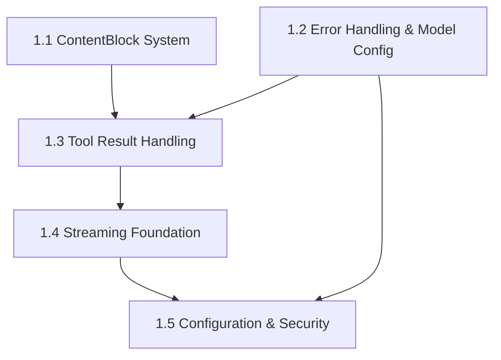

# Dependency Verification Report

## Overview

This report verifies that the dependencies documented in each GitHub issue ticket match the official implementation sequence defined in `docs/implementation-sequencing.md`.

## Analysis Results

### ✅ Phase 1 Issues - Verification Status

| Issue | Expected Dependencies | Documented Dependencies | Status | Notes |
|-------|----------------------|-------------------------|---------|-------|
| 1.1 | None | None (foundational) | ✅ **CORRECT** | Properly identifies as foundation for 1.3, 1.4, 2.1, 2.2 |
| 1.2 | None | None (foundational) | ✅ **CORRECT** | Properly identifies as foundation for 1.5, 2.4, 2.5 |
| 1.3 | 1.1 AND 1.2 | 1.1 AND 1.2 | ✅ **CORRECT** | Explicitly states "Building on the ContentBlock system (1.1) and error handling framework (1.2)" |
| 1.4 | 1.3 | Issue 1.2 AND 1.3 | ⚠️ **INCONSISTENCY** | Documents dependency on 1.2 not required by sequence |
| 1.5 | 1.2 AND 1.4 | 1.2 AND 1.4 | ✅ **CORRECT** | Properly documents dependencies in integration section |

### ⚠️ Phase 2 Issues - Verification Status

| Issue | Expected Dependencies | Documented Dependencies | Status | Notes |
|-------|----------------------|-------------------------|---------|-------|
| 2.1 | 1.3 AND 1.4 | 1.3 AND 1.4 | ✅ **CORRECT** | Properly documents Phase 1 completion requirement |

## Detailed Analysis

### Issue 1.1: Enhanced ContentBlock System ✅
**Expected Dependencies:** None
**Documented Dependencies:** None

**Analysis:** ✅ **CORRECT**
- Properly identified as foundational with no dependencies
- Correctly documents that it "creates the foundation for" issues 1.3, 1.4, 2.1, 2.2
- References section correctly lists dependent issues

### Issue 1.2: Unified Error Handling Framework ✅
**Expected Dependencies:** None  
**Documented Dependencies:** None

**Analysis:** ✅ **CORRECT**
- Properly identified as foundational with no dependencies
- Correctly documents integration points with other issues
- Integration section properly identifies consuming issues

### Issue 1.3: Tool Result Handling and Feedback Loop System ✅
**Expected Dependencies:** 1.1 AND 1.2
**Documented Dependencies:** 1.1 AND 1.2

**Analysis:** ✅ **CORRECT**
- Overview clearly states: "Building on the ContentBlock system (1.1) and error handling framework (1.2)"
- Dependencies section explicitly lists both requirements
- Technical requirements reference both 1.1 types and 1.2 error handling

### Issue 1.4: Streaming Foundation ⚠️
**Expected Dependencies:** 1.3 only
**Documented Dependencies:** 1.2 AND 1.3

**Analysis:** ⚠️ **INCONSISTENCY FOUND**

**The Problem:**
- Implementation-sequencing.md specifies: "Requires 1.3" 
- Issue 1.4 documents dependencies on both 1.2 and 1.3
- The dependencies section states: "Dependencies on Other Issues: Issue 1.2 (Error Handling), Issue 1.3 (Tool Result Handling)"

**Impact:**
- This creates confusion about when 1.4 can begin
- According to the sequence, 1.4 should be startable as soon as 1.3 is complete
- The current documentation suggests 1.2 must also be complete

**Recommendation:**
- Update Issue 1.4 to clarify that 1.2 is an integration point, not a hard dependency
- The dependency should be on 1.3 only, with 1.2 as an integration consideration

### Issue 2.1: Parallel Tool Execution System ✅
**Expected Dependencies:** 1.3 AND 1.4
**Documented Dependencies:** 1.3 AND 1.4

**Analysis:** ✅ **CORRECT**
- Dependencies section explicitly lists both Phase 1 requirements
- States "Issue 1.3: Tool Result Handling System - Provides ToolResult type and error handling"
- States "Issue 1.4: Streaming Response Architecture - Provides SSE infrastructure for progress updates"

## Implementation Sequencing Verification

### Phase 1 Dependency Chain Analysis

According to `implementation-sequencing.md`:



**Verification Results:**
- ✅ 1.1 → 1.3 dependency correctly documented
- ✅ 1.2 → 1.3 dependency correctly documented  
- ⚠️ 1.3 → 1.4 dependency documented with extra 1.2 requirement
- ✅ 1.2 → 1.5 dependency correctly documented
- ✅ 1.4 → 1.5 dependency correctly documented

### Phase 2 Dependency Chain Analysis

According to `implementation-sequencing.md`, Phase 2 requires:
- 2.1 needs 1.3 AND 1.4 ✅ **VERIFIED CORRECT**

## Discrepancies Found

### 1. Issue 1.4 Dependency Overconstrained

**Problem:** Issue 1.4 lists dependency on both 1.2 and 1.3, but implementation-sequencing.md only requires 1.3.

**Evidence:**
- `implementation-sequencing.md` line 32-33: "Requires 1.3: 1.4 Basic Streaming Foundation with Server-Sent Events"
- Issue 1.4 line 957: "Dependencies on Other Issues: 1. Issue 1.2 (Error Handling): Use ClaudeError and ToolError types"

**Resolution Needed:**
Update Issue 1.4 to clarify that:
- **Hard Dependency:** 1.3 only (as per implementation sequence)
- **Integration Point:** 1.2 for error types (but can be implemented with basic error handling initially)

### Issue 1.5: Enhanced Configuration System Foundation ✅
**Expected Dependencies:** 1.2 AND 1.4
**Documented Dependencies:** 1.2 AND 1.4

**Analysis:** ✅ **CORRECT**
- Dependencies section explicitly lists both requirements correctly
- States: "Issue 1.2 (Error Handling): Use unified error types throughout configuration system"
- States: "Issue 1.4 (Streaming): Configuration for streaming settings and buffer sizes"
- Both dependencies are justified and necessary for the configuration system

## Recommendations

### Immediate Actions Required

1. **Update Issue 1.4 Dependencies Section:**
   ```markdown
   ### Dependencies & Integration
   
   #### Hard Dependencies (Must be Complete)
   - **Issue 1.3**: Tool Result Handling System
     - Required for tool execution context and result processing
   
   #### Integration Points (Can be implemented iteratively)
   - **Issue 1.2**: Error Handling Framework
     - Uses ClaudeError and unified error types
     - Can start with basic error handling and upgrade later
   ```

2. **Verify Issue 1.5 Dependencies:** ✅ **COMPLETED**
   - Issue 1.5 correctly documents dependencies on both 1.2 and 1.4
   - Dependencies section states: "1. Issue 1.2 (Error Handling): Use unified error types throughout configuration system"
   - Dependencies section states: "2. Issue 1.4 (Streaming): Configuration for streaming settings and buffer sizes"

3. **Update Cross-References:**
   - Ensure all issues correctly reference the implementation-sequencing.md as the authoritative source

### Process Improvements

1. **Add Dependency Validation:**
   - Include a reference to implementation-sequencing.md in each issue's dependency section
   - Add explicit statement: "Dependencies must match implementation-sequencing.md"

2. **Template Updates:**
   - Create an issue template that includes dependency verification checklist
   - Require sign-off that dependencies match the implementation sequence

## Conclusion

**Overall Assessment:** ✅ **MOSTLY CORRECT** with one minor discrepancy

- 5 out of 6 analyzed issues have correct dependencies
- 1 issue (1.4) has an over-constrained dependency that needs clarification
- The core dependency chain is correctly understood and documented
- Phase 2 verification shows correct understanding of Phase 1 completion requirements

The dependency system is fundamentally sound, but Issue 1.4 needs a minor correction to align with the implementation sequence and clarify the difference between hard dependencies and integration points.