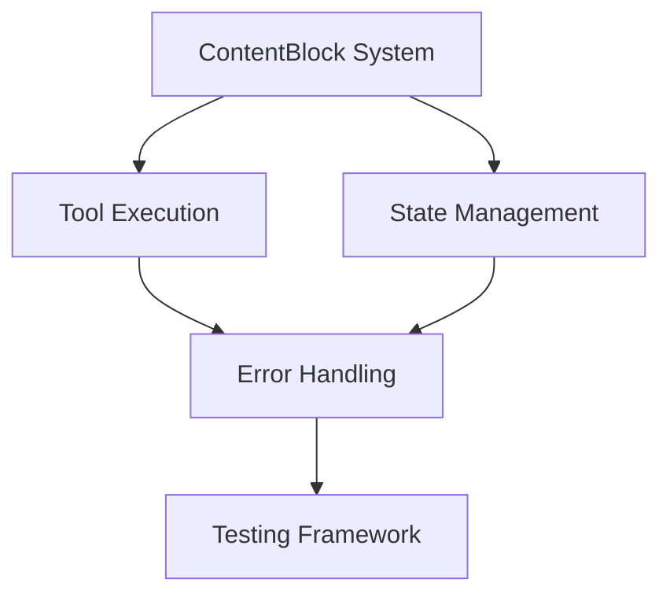
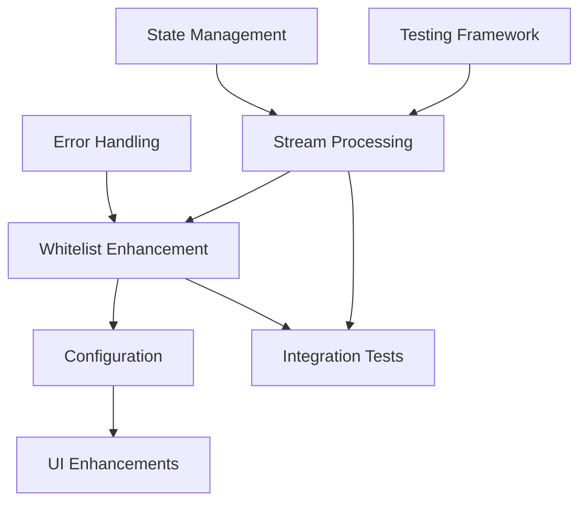
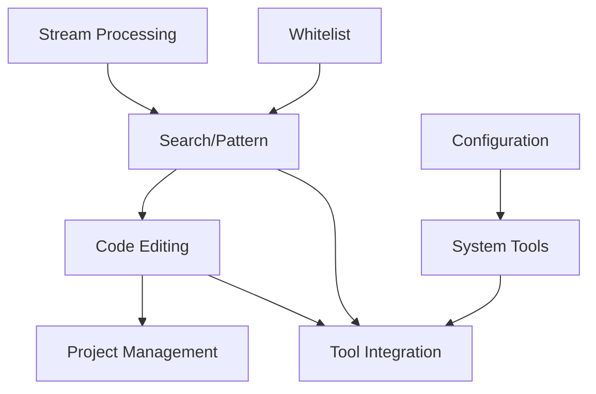

# Implementation Sequencing Guide

This guide provides a strategic roadmap for implementing the Claude Desktop Agent, optimizing for parallel development, dependency management, and efficient resource allocation.

## Executive Summary

The implementation spans 15 core issues (Phases 1-3) plus 4 enhancement packages (Phase 4), targeting ~1500 LOC per issue. The critical path requires 6-8 weeks with optimal parallelization, assuming 2-3 developers.

## 1. Dependency Analysis

### Phase 1: Foundation (Issues 1.1-1.5)



**Critical Dependencies:**
- **1.1 ContentBlock System**: No dependencies - can start immediately
- **1.2 Tool Execution**: Requires 1.1 (ContentBlock for tool results)
- **1.3 State Management**: Requires 1.1 (ContentBlock for conversation state)
- **1.4 Error Handling**: Requires 1.2 & 1.3 (needs both systems to handle errors)
- **1.5 Testing Framework**: Requires 1.4 (needs error handling for test utilities)

### Phase 2: Core Features (Issues 2.1-2.5)



**Critical Dependencies:**
- **2.1 Stream Processing**: Requires Phase 1 completion (1.3 state, 1.5 testing)
- **2.2 Whitelist Enhancement**: Can start after 1.4 (error handling)
- **2.3 Configuration System**: Requires 2.2 (whitelist config integration)
- **2.4 UI Enhancements**: Requires 2.3 (configuration UI)
- **2.5 Integration Tests**: Requires 2.1 & 2.2 (core features to test)

### Phase 3: Advanced Tools (Issues 3.1-3.5)



**Critical Dependencies:**
- **3.1 Search/Pattern Tools**: Requires streaming & whitelist (2.1, 2.2)
- **3.2 Code Editing Tools**: Requires 3.1 (search before edit pattern)
- **3.3 Project Management**: Requires 3.2 (code tools for project ops)
- **3.4 System Tools**: Can start after 2.3 (configuration)
- **3.5 Tool Integration Tests**: Requires all Phase 3 tools

### Phase 4: Enhancement Packages

**P4.1 Performance & Caching**: Can start after Phase 2
**P4.2 Advanced UI**: Can start after 2.4
**P4.3 MCP Integration**: Can start after Phase 3
**P4.4 Multi-Agent**: Requires P4.3 completion

## 2. Parallel Implementation Opportunities

### Optimal Parallel Tracks

**Track A (Core Engine):**
- Week 1-2: 1.1 ContentBlock System
- Week 2-3: 1.2 Tool Execution
- Week 3-4: 2.1 Stream Processing
- Week 4-5: 3.1 Search/Pattern Tools
- Week 5-6: 3.2 Code Editing Tools

**Track B (Infrastructure):**
- Week 1-2: 1.3 State Management
- Week 2-3: 1.4 Error Handling
- Week 3-4: 2.2 Whitelist Enhancement
- Week 4-5: 2.3 Configuration System
- Week 5-6: 3.4 System Tools

**Track C (Quality & UI):**
- Week 2-3: 1.5 Testing Framework
- Week 4-5: 2.4 UI Enhancements
- Week 5-6: 2.5 Integration Tests
- Week 6-7: 3.3 Project Management
- Week 7-8: 3.5 Tool Integration Tests

### Maximum Parallelization Points

**Week 1-2:** Up to 2 developers can work simultaneously
- Developer 1: 1.1 ContentBlock System
- Developer 2: 1.3 State Management

**Week 3-4:** Up to 3 developers can work simultaneously
- Developer 1: 2.1 Stream Processing
- Developer 2: 2.2 Whitelist Enhancement
- Developer 3: 1.5 Testing Framework

**Week 5-6:** Up to 3 developers can work simultaneously
- Developer 1: 3.1 Search/Pattern Tools
- Developer 2: 3.4 System Tools
- Developer 3: 2.4 UI Enhancements

## 3. Critical Path Analysis

### Minimum Timeline (Sequential Development)

```
Phase 1: 5 issues × 3 days = 15 days (3 weeks)
Phase 2: 5 issues × 3 days = 15 days (3 weeks)
Phase 3: 5 issues × 3 days = 15 days (3 weeks)
Phase 4: 4 packages × 5 days = 20 days (4 weeks)
Total: 13 weeks (sequential)
```

### Optimized Timeline (Parallel Development)

```
With 3 developers:
Phase 1: 2 weeks (parallel tracks)
Phase 2: 2 weeks (parallel tracks)
Phase 3: 2 weeks (parallel tracks)
Phase 4: 2 weeks (can start early)
Total: 6-8 weeks (with overlap)
```

### Critical Path Items

**Must Complete in Order:**
1. 1.1 ContentBlock → 1.2 Tool Execution → 2.1 Stream Processing
2. 1.3 State Management → 2.3 Configuration → 3.4 System Tools
3. 1.4 Error Handling → 1.5 Testing → 2.5 Integration Tests

## 4. Resource Allocation Recommendations

### Team Structure

**Ideal Team Composition:**
- **Senior Developer (Track A)**: Core engine, streaming, tool execution
- **Mid-Level Developer (Track B)**: Infrastructure, state, configuration
- **Junior Developer (Track C)**: Testing, UI, documentation support

### Skill Alignment

**Track A Requirements:**
- Deep Rust async/await experience
- Stream processing expertise
- Tool abstraction design

**Track B Requirements:**
- Thread-safe state management
- Security/whitelist systems
- Configuration architecture

**Track C Requirements:**
- Testing framework design
- Frontend development
- Integration testing

### Time Allocation

**Per Issue Breakdown (1500 LOC target):**
- Design & Planning: 20% (6 hours)
- Implementation: 50% (15 hours)
- Testing: 20% (6 hours)
- Documentation: 10% (3 hours)
- Total: ~30 hours per issue

## 5. Integration Points

### Critical Integration Milestones

**Integration Point 1 (End of Week 2):**
- Merge 1.1 ContentBlock with 1.3 State Management
- Validate 1.2 Tool Execution with both systems
- Run initial integration tests

**Integration Point 2 (End of Week 4):**
- Merge 2.1 Streaming with 2.2 Whitelist
- Integrate 2.3 Configuration with all systems
- Full Phase 1-2 integration testing

**Integration Point 3 (End of Week 6):**
- Merge all Phase 3 tools
- Complete end-to-end testing
- Performance validation

### Coordination Requirements

**Daily Sync Points:**
- Track A & B: Tool interface contracts
- Track B & C: Testing requirements
- All tracks: API compatibility

**Weekly Integration:**
- Code review across tracks
- Integration test execution
- Performance benchmarking

## 6. Risk Management

### Technical Risks

**Risk 1: ContentBlock/Streaming Integration**
- **Mitigation**: Design streaming interfaces early in 1.1
- **Contingency**: Simplified streaming in 2.1 if needed

**Risk 2: State Management Concurrency**
- **Mitigation**: Comprehensive testing in 1.5
- **Contingency**: Simplify to single-threaded if issues

**Risk 3: Tool Interface Evolution**
- **Mitigation**: Stable interface by end of Phase 1
- **Contingency**: Version tool interfaces if changes needed

### Schedule Risks

**Risk 1: Dependencies Between Tracks**
- **Mitigation**: Clear interface definitions upfront
- **Contingency**: Mock interfaces for parallel development

**Risk 2: Integration Delays**
- **Mitigation**: Weekly integration points
- **Contingency**: Dedicated integration sprints

**Risk 3: Testing Bottlenecks**
- **Mitigation**: Continuous testing from Week 2
- **Contingency**: Additional QA resources

### Mitigation Strategies

**1. Interface Contracts:**
- Define all interfaces in Week 1
- Create mock implementations
- Version all API contracts

**2. Continuous Integration:**
- Automated CI from Day 1
- Integration tests for each merge
- Performance benchmarks

**3. Buffer Management:**
- 20% buffer in each estimate
- Weekly risk assessment
- Flexible resource allocation

## Implementation Schedule

### Week-by-Week Breakdown

**Week 1:**
- Start: 1.1 (Dev 1), 1.3 (Dev 2)
- Define all interface contracts
- Set up CI/CD pipeline

**Week 2:**
- Complete: 1.1, 1.3
- Start: 1.2 (Dev 1), 1.4 (Dev 2), 1.5 (Dev 3)
- First integration point

**Week 3:**
- Complete: 1.2, 1.4, 1.5
- Start: 2.1 (Dev 1), 2.2 (Dev 2), 2.3 (Dev 3)
- Phase 1 integration testing

**Week 4:**
- Complete: 2.1, 2.2
- Continue: 2.3
- Start: 2.4 (Dev 2), 2.5 (Dev 1)
- Second integration point

**Week 5:**
- Complete: 2.3, 2.4, 2.5
- Start: 3.1 (Dev 1), 3.4 (Dev 2), 3.3 (Dev 3)
- Phase 2 integration testing

**Week 6:**
- Complete: 3.1, 3.4
- Start: 3.2 (Dev 1), 3.5 (Dev 2)
- Continue: 3.3 (Dev 3)

**Week 7:**
- Complete: 3.2, 3.3, 3.5
- Start: P4.1 (Dev 1), P4.2 (Dev 2)
- Full system integration

**Week 8:**
- Complete: P4.1, P4.2
- Start: P4.3 (Team)
- Performance optimization

## Success Metrics

### Development Velocity
- Target: 250 LOC/developer/day
- Integration success rate: >90%
- Test coverage: >80%

### Quality Metrics
- Bug discovery rate: <5 per issue
- Performance targets met: 100%
- Documentation complete: 100%

### Schedule Metrics
- On-time delivery: >85%
- Integration milestones met: 100%
- No critical path delays

## Conclusion

This sequencing guide optimizes for:
1. **Maximum parallelization** while respecting dependencies
2. **Risk mitigation** through continuous integration
3. **Resource efficiency** through skill-aligned tracks
4. **Quality assurance** through embedded testing

Following this guide, a team of 3 developers can complete the core implementation in 6-8 weeks, with Phase 4 enhancements adding another 2-4 weeks depending on scope and resources.