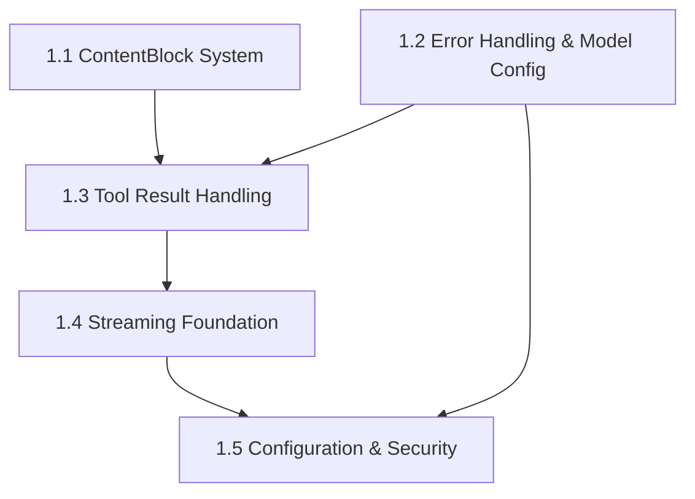
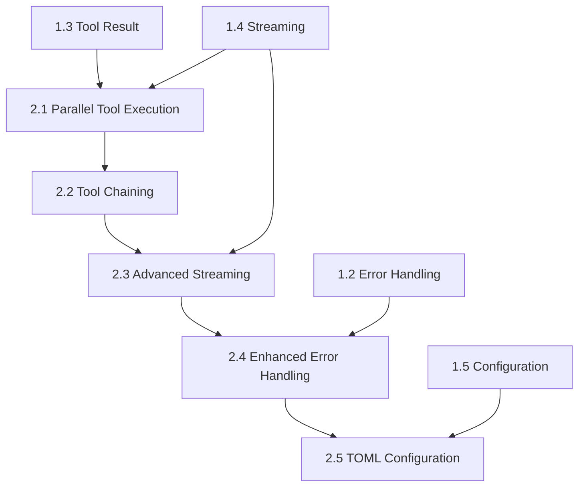
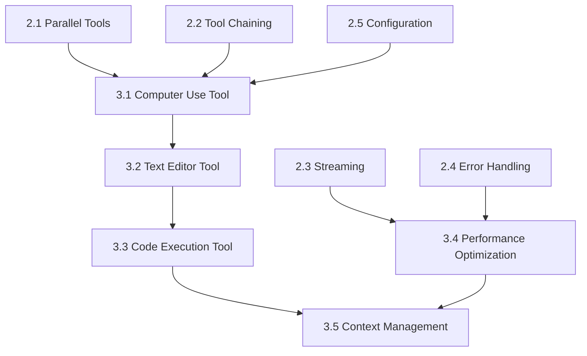
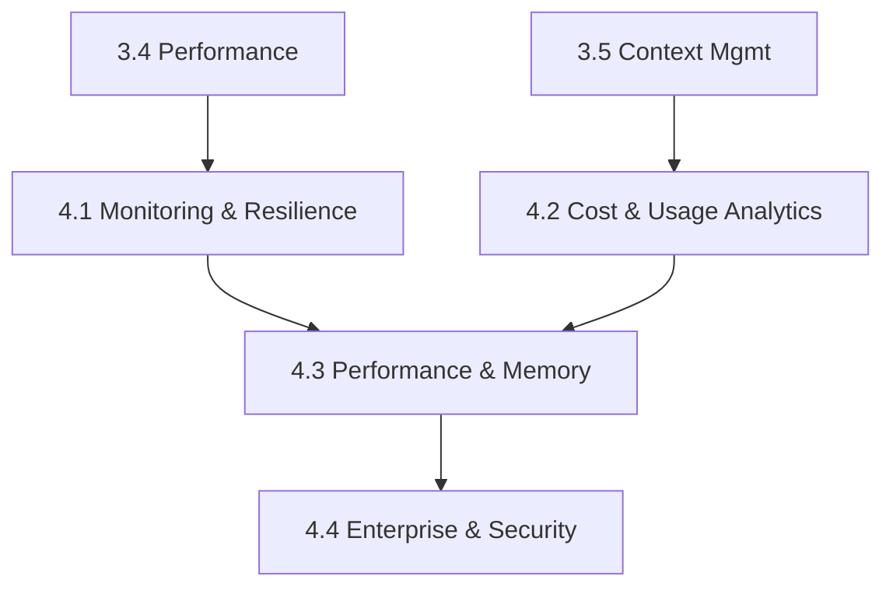

# Implementation Sequencing Guide

This guide shows the dependency order for implementing the Claude Desktop Agent. Use this to determine which issues you can work on and in what order.

## Phase Overview

- **Phase 1: Foundation** (Issues 1.1-1.5) - Core infrastructure and base systems
- **Phase 2: Core Features** (Issues 2.1-2.5) - Essential functionality 
- **Phase 3: Advanced Tools** (Issues 3.1-3.5) - Extended capabilities
- **Phase 4: Enhancements** (Issues 4.1-4.4) - Performance and enterprise features

## Phase 1: Foundation Dependencies

### Implementation Order:

**Can start immediately (no dependencies):**
- 1.1 Enhanced ContentBlock System and Message Processing
- 1.2 Unified Error Handling Framework and Model Configuration System

**Requires 1.1 AND 1.2:**
- 1.3 Tool Result Handling and Feedback Loop System

**Requires 1.3:**
- 1.4 Basic Streaming Foundation with Server-Sent Events

**Requires 1.2 AND 1.4:**
- 1.5 Enhanced Configuration System Foundation with API Security Integration

## Phase 2: Core Features Dependencies

### Implementation Order:

**Requires Phase 1 completion:**
- 2.1 Parallel Tool Execution System (needs 1.3 and 1.4)

**Requires 2.1:**
- 2.2 Tool Chaining and Orchestration System

**Can start after 1.4, but optimal after 2.2:**
- 2.3 Advanced Streaming Implementation

**Can start after 1.2, but optimal after 2.3:**
- 2.4 Enhanced Error Handling and Retry Mechanisms

**Can start after 1.5, but optimal after 2.4:**
- 2.5 Comprehensive Configuration System with TOML Support

## Phase 3: Advanced Tools Dependencies

### Implementation Order:

**Requires 2.1, 2.2, and 2.5:**
- 3.1 Computer Use Tool Implementation

**Requires 3.1:**
- 3.2 Text Editor Tool with Advanced Editing Commands

**Requires 3.2:**
- 3.3 Code Execution Tool Integration

**Can start after 2.3 and 2.4:**
- 3.4 Performance Optimization and Production Hardening

**Requires 3.3 AND 3.4:**
- 3.5 Advanced Context Management and Memory System

## Phase 4: Enhancement Packages

### Implementation Order:

**Can start after Phase 3:**
- 4.1 Monitoring and Resilience Enhancement Package (needs 3.4)
- 4.2 Cost and Usage Analytics Enhancement Package (needs 3.5)

**Requires 4.1 AND 4.2:**
- 4.3 Performance and Memory Enhancement Package

**Requires 4.3:**
- 4.4 Enterprise and Security Enhancement Package

## Quick Reference: What Can I Work On?

### If nothing is implemented yet:
Start with **1.1** or **1.2** (both have no dependencies)

### If Phase 1 is partially complete:
- If 1.1 and 1.2 are done → work on **1.3**
- If 1.3 is done → work on **1.4**
- If 1.2 and 1.4 are done → work on **1.5**

### If Phase 1 is complete:
- Start with **2.1** (requires 1.3 and 1.4)
- If you need lighter work, consider starting **2.4** prep (builds on 1.2)

### Parallel Work Opportunities:
- **Phase 1**: 1.1 and 1.2 can be done simultaneously
- **Phase 2**: After prerequisites, 2.3 prep and 2.4 prep can overlap with main track
- **Phase 3**: 3.1-3.3 (main track) and 3.4 (performance track) can run in parallel
- **Phase 4**: 4.1 and 4.2 can be done simultaneously

## Key Dependencies to Remember

1. **Tool System Flow**: 1.1 → 1.3 → 2.1 → 2.2 → 3.1 → 3.2 → 3.3
2. **Streaming Flow**: 1.4 → 2.3 → 3.4
3. **Configuration Flow**: 1.2 → 1.5 → 2.5 → 3.1
4. **Error Handling Flow**: 1.2 → 2.4 → 3.4

## Notes for Developers

- Each issue targets ~1000-1500 lines of code
- Issues include their own testing requirements
- Check the GitHub issue for full technical specifications
- Dependencies are strict - don't start an issue until its prerequisites are complete
- When in doubt, check the mermaid diagrams above