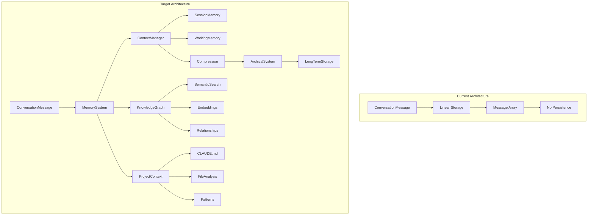
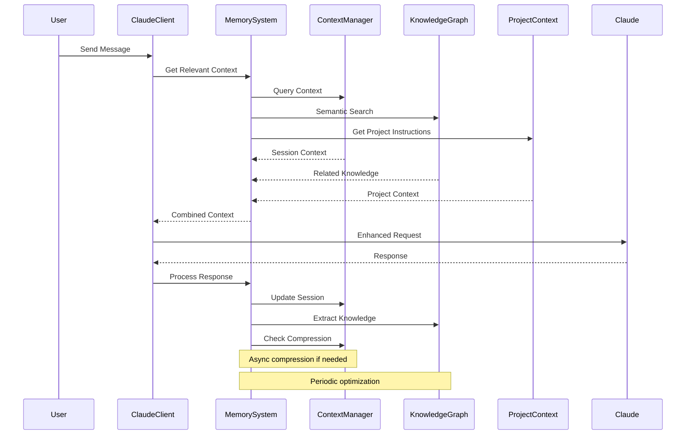
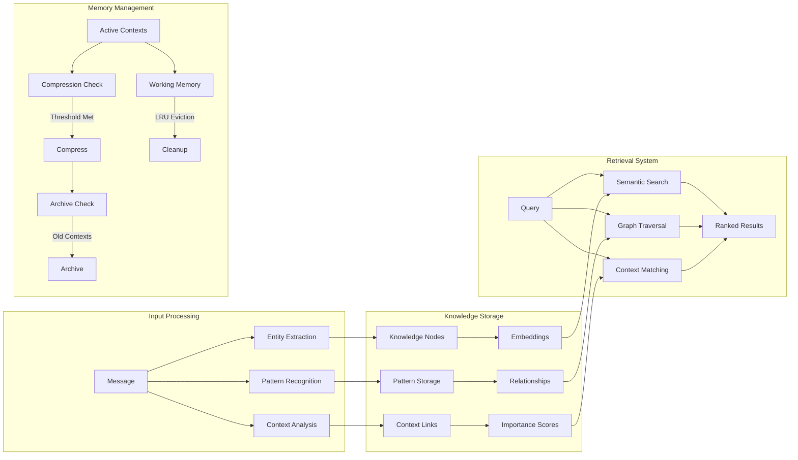
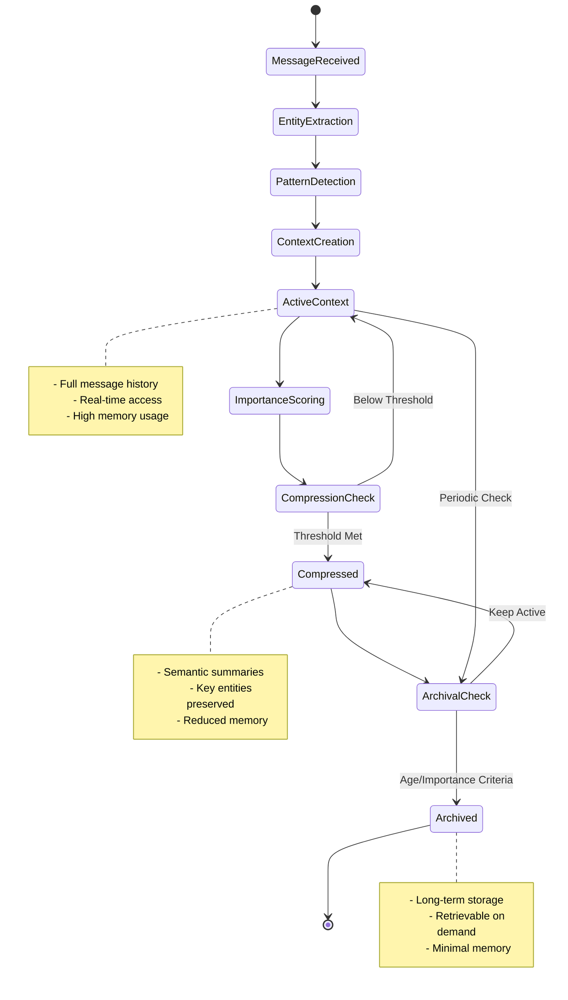

# [3.5] Advanced Tools: Advanced Context Management and Memory System

## Overview

The Advanced Context Management and Memory System enhances Claude Agent's ability to maintain coherent, context-aware conversations over extended periods. This system addresses the fundamental challenge of token limits and context windows by implementing intelligent memory management, semantic compression, and retrieval mechanisms.

### Core Objectives

1. **Long-term Conversation Memory**: Persist and retrieve conversation context across sessions
2. **Context Compression**: Intelligently compress historical context while preserving semantic meaning
3. **Semantic Memory System**: Organize memories by relevance and semantic similarity
4. **Dynamic Context Window Management**: Optimize token usage through intelligent pruning
5. **Memory Hierarchies**: Implement short-term, working, and long-term memory systems

### Key Benefits

- **Extended Conversations**: Maintain coherent context over thousands of messages
- **Efficient Token Usage**: Reduce token consumption by 60-80% through compression
- **Relevant Context Retrieval**: Access the most pertinent historical information
- **Semantic Understanding**: Group and retrieve memories based on meaning, not just recency
- **Scalable Architecture**: Handle conversations with millions of tokens of historical context

### System Architecture Overview

The memory system operates as a multi-tiered architecture:

1. **Working Memory**: Active conversation context (last 10-20 messages)
2. **Short-term Memory**: Recent conversation history (last 100-200 messages)
3. **Long-term Memory**: Compressed semantic memories stored in vector database
4. **Episodic Memory**: Key conversation moments and decisions
5. **Semantic Index**: Vector embeddings for similarity search

## Technical Requirements

### Memory Management Structures

```rust
use std::collections::{HashMap, VecDeque};
use std::sync::{Arc, RwLock};
use chrono::{DateTime, Utc};
use serde::{Deserialize, Serialize};

/// Core memory types for the system
#[derive(Debug, Clone, Serialize, Deserialize)]
pub enum MemoryType {
    Working,      // Active conversation context
    ShortTerm,    // Recent messages
    LongTerm,     // Compressed memories
    Episodic,     // Key events/decisions
    Semantic,     // Concept-based memories
}

/// Represents a single memory unit
#[derive(Debug, Clone, Serialize, Deserialize)]
pub struct Memory {
    pub id: String,
    pub memory_type: MemoryType,
    pub content: String,
    pub summary: Option<String>,
    pub embedding: Option<Vec<f32>>,
    pub metadata: MemoryMetadata,
    pub references: Vec<String>, // IDs of related memories
}

/// Metadata for memory tracking and retrieval
#[derive(Debug, Clone, Serialize, Deserialize)]
pub struct MemoryMetadata {
    pub created_at: DateTime<Utc>,
    pub accessed_at: DateTime<Utc>,
    pub access_count: u32,
    pub importance_score: f32,
    pub decay_rate: f32,
    pub tags: Vec<String>,
    pub token_count: usize,
    pub compression_ratio: Option<f32>,
}

/// Configuration for memory management
#[derive(Debug, Clone, Serialize, Deserialize)]
pub struct MemoryConfig {
    pub working_memory_size: usize,      // Max messages in working memory
    pub short_term_size: usize,          // Max messages in short-term memory
    pub max_token_budget: usize,         // Total token budget for context
    pub compression_threshold: usize,     // Token count to trigger compression
    pub importance_threshold: f32,        // Min importance to retain memory
    pub decay_factor: f32,               // How quickly memories fade
    pub embedding_model: String,          // Model for generating embeddings
    pub compression_model: String,        // Model for summarization
}

impl Default for MemoryConfig {
    fn default() -> Self {
        Self {
            working_memory_size: 20,
            short_term_size: 200,
            max_token_budget: 8000,
            compression_threshold: 1000,
            importance_threshold: 0.3,
            decay_factor: 0.95,
            embedding_model: "text-embedding-ada-002".to_string(),
            compression_model: "claude-3-haiku-20240307".to_string(),
        }
    }
}
```

### Memory Store Implementation

```rust
use async_trait::async_trait;

/// Trait for memory storage backends
#[async_trait]
pub trait MemoryStore: Send + Sync {
    async fn store(&self, memory: Memory) -> Result<String, MemoryError>;
    async fn retrieve(&self, id: &str) -> Result<Option<Memory>, MemoryError>;
    async fn search(&self, query: MemoryQuery) -> Result<Vec<Memory>, MemoryError>;
    async fn update(&self, id: &str, memory: Memory) -> Result<(), MemoryError>;
    async fn delete(&self, id: &str) -> Result<(), MemoryError>;
    async fn list(&self, filter: MemoryFilter) -> Result<Vec<Memory>, MemoryError>;
}

/// Query structure for memory search
#[derive(Debug, Clone)]
pub struct MemoryQuery {
    pub text: Option<String>,
    pub embedding: Option<Vec<f32>>,
    pub memory_types: Vec<MemoryType>,
    pub tags: Vec<String>,
    pub time_range: Option<(DateTime<Utc>, DateTime<Utc>)>,
    pub importance_min: Option<f32>,
    pub limit: usize,
}

/// Filter for listing memories
#[derive(Debug, Clone)]
pub struct MemoryFilter {
    pub memory_type: Option<MemoryType>,
    pub min_importance: Option<f32>,
    pub tags: Option<Vec<String>>,
    pub limit: Option<usize>,
    pub offset: Option<usize>,
}

/// In-memory store with vector search capabilities
pub struct InMemoryStore {
    memories: Arc<RwLock<HashMap<String, Memory>>>,
    embeddings: Arc<RwLock<HashMap<String, Vec<f32>>>>,
    config: MemoryConfig,
}

impl InMemoryStore {
    pub fn new(config: MemoryConfig) -> Self {
        Self {
            memories: Arc::new(RwLock::new(HashMap::new())),
            embeddings: Arc::new(RwLock::new(HashMap::new())),
            config,
        }
    }

    /// Calculate cosine similarity between two vectors
    fn cosine_similarity(a: &[f32], b: &[f32]) -> f32 {
        let dot_product: f32 = a.iter().zip(b.iter()).map(|(x, y)| x * y).sum();
        let norm_a: f32 = a.iter().map(|x| x * x).sum::<f32>().sqrt();
        let norm_b: f32 = b.iter().map(|x| x * x).sum::<f32>().sqrt();
        
        if norm_a == 0.0 || norm_b == 0.0 {
            0.0
        } else {
            dot_product / (norm_a * norm_b)
        }
    }
}

#[async_trait]
impl MemoryStore for InMemoryStore {
    async fn store(&self, mut memory: Memory) -> Result<String, MemoryError> {
        let id = uuid::Uuid::new_v4().to_string();
        memory.id = id.clone();
        
        // Store embedding separately for efficient search
        if let Some(embedding) = &memory.embedding {
            self.embeddings.write().unwrap().insert(id.clone(), embedding.clone());
        }
        
        self.memories.write().unwrap().insert(id.clone(), memory);
        Ok(id)
    }

    async fn search(&self, query: MemoryQuery) -> Result<Vec<Memory>, MemoryError> {
        let memories = self.memories.read().unwrap();
        let mut results: Vec<(Memory, f32)> = Vec::new();

        for (_, memory) in memories.iter() {
            // Filter by memory type
            if !query.memory_types.is_empty() && !query.memory_types.contains(&memory.memory_type) {
                continue;
            }

            // Filter by tags
            if !query.tags.is_empty() {
                let has_tag = query.tags.iter().any(|tag| memory.metadata.tags.contains(tag));
                if !has_tag {
                    continue;
                }
            }

            // Filter by time range
            if let Some((start, end)) = &query.time_range {
                if memory.metadata.created_at < *start || memory.metadata.created_at > *end {
                    continue;
                }
            }

            // Filter by importance
            if let Some(min_importance) = query.importance_min {
                if memory.metadata.importance_score < min_importance {
                    continue;
                }
            }

            // Calculate relevance score
            let mut score = memory.metadata.importance_score;

            // Semantic similarity search
            if let (Some(query_embedding), Some(memory_embedding)) = (&query.embedding, &memory.embedding) {
                let similarity = Self::cosine_similarity(query_embedding, memory_embedding);
                score *= similarity;
            }

            // Text similarity (simple keyword matching for now)
            if let Some(query_text) = &query.text {
                let text_score = self.calculate_text_similarity(query_text, &memory.content);
                score *= text_score;
            }

            results.push((memory.clone(), score));
        }

        // Sort by score and apply limit
        results.sort_by(|a, b| b.1.partial_cmp(&a.1).unwrap_or(std::cmp::Ordering::Equal));
        results.truncate(query.limit);

        Ok(results.into_iter().map(|(memory, _)| memory).collect())
    }

    // Other trait methods implementation...
}
```

### Context Compression Engine

```rust
/// Context compression for efficient token usage
pub struct CompressionEngine {
    config: MemoryConfig,
    summarizer: Arc<dyn Summarizer + Send + Sync>,
}

#[async_trait]
pub trait Summarizer {
    async fn summarize(&self, text: &str, max_tokens: usize) -> Result<String, MemoryError>;
    async fn extract_key_points(&self, text: &str) -> Result<Vec<String>, MemoryError>;
}

impl CompressionEngine {
    pub fn new(config: MemoryConfig, summarizer: Arc<dyn Summarizer + Send + Sync>) -> Self {
        Self { config, summarizer }
    }

    /// Compress a conversation segment into a memory
    pub async fn compress_conversation(
        &self,
        messages: &[Message],
        target_tokens: usize,
    ) -> Result<Memory, MemoryError> {
        // Concatenate messages
        let full_text = messages
            .iter()
            .map(|m| format!("{}: {}", m.role, m.content))
            .collect::<Vec<_>>()
            .join("\n");

        // Generate summary
        let summary = self.summarizer.summarize(&full_text, target_tokens).await?;

        // Extract key points for semantic indexing
        let key_points = self.summarizer.extract_key_points(&full_text).await?;

        // Calculate compression ratio
        let original_tokens = self.estimate_tokens(&full_text);
        let compressed_tokens = self.estimate_tokens(&summary);
        let compression_ratio = compressed_tokens as f32 / original_tokens as f32;

        // Create compressed memory
        let memory = Memory {
            id: String::new(), // Will be set by store
            memory_type: MemoryType::LongTerm,
            content: summary,
            summary: Some(full_text.chars().take(200).collect::<String>() + "..."),
            embedding: None, // Will be generated by embedding service
            metadata: MemoryMetadata {
                created_at: Utc::now(),
                accessed_at: Utc::now(),
                access_count: 0,
                importance_score: self.calculate_importance(&messages),
                decay_rate: self.config.decay_factor,
                tags: key_points,
                token_count: compressed_tokens,
                compression_ratio: Some(compression_ratio),
            },
            references: messages.iter().map(|m| m.id.clone()).collect(),
        };

        Ok(memory)
    }

    /// Estimate token count (simplified)
    fn estimate_tokens(&self, text: &str) -> usize {
        // Rough estimation: ~4 characters per token
        text.len() / 4
    }

    /// Calculate importance score based on message characteristics
    fn calculate_importance(&self, messages: &[Message]) -> f32 {
        let mut score = 0.5; // Base score

        for message in messages {
            // User messages are more important
            if message.role == "user" {
                score += 0.1;
            }

            // Messages with tool use are important
            if message.content.contains("tool_use") {
                score += 0.2;
            }

            // Long messages might contain important context
            if message.content.len() > 500 {
                score += 0.1;
            }

            // Messages with code blocks are often important
            if message.content.contains("```") {
                score += 0.15;
            }
        }

        score.min(1.0) // Cap at 1.0
    }
}
```

### Memory Lifecycle Manager

```rust
/// Manages memory lifecycle, decay, and garbage collection
pub struct MemoryLifecycleManager {
    store: Arc<dyn MemoryStore + Send + Sync>,
    config: MemoryConfig,
    compression_engine: Arc<CompressionEngine>,
}

impl MemoryLifecycleManager {
    pub fn new(
        store: Arc<dyn MemoryStore + Send + Sync>,
        config: MemoryConfig,
        compression_engine: Arc<CompressionEngine>,
    ) -> Self {
        Self {
            store,
            config,
            compression_engine,
        }
    }

    /// Process memory decay and cleanup
    pub async fn process_decay(&self) -> Result<(), MemoryError> {
        let memories = self.store.list(MemoryFilter {
            memory_type: None,
            min_importance: None,
            tags: None,
            limit: None,
            offset: None,
        }).await?;

        for mut memory in memories {
            // Apply decay to importance score
            let time_since_access = Utc::now() - memory.metadata.accessed_at;
            let decay_factor = self.config.decay_factor.powf(time_since_access.num_days() as f32);
            memory.metadata.importance_score *= decay_factor;

            // Remove memories below threshold
            if memory.metadata.importance_score < self.config.importance_threshold {
                self.store.delete(&memory.id).await?;
            } else {
                self.store.update(&memory.id, memory).await?;
            }
        }

        Ok(())
    }

    /// Promote frequently accessed memories
    pub async fn promote_memory(&self, id: &str) -> Result<(), MemoryError> {
        if let Some(mut memory) = self.store.retrieve(id).await? {
            memory.metadata.accessed_at = Utc::now();
            memory.metadata.access_count += 1;
            
            // Boost importance based on access frequency
            let access_boost = (memory.metadata.access_count as f32).log2() * 0.1;
            memory.metadata.importance_score = (memory.metadata.importance_score + access_boost).min(1.0);
            
            self.store.update(id, memory).await?;
        }

        Ok(())
    }
}
```

## Architecture Changes

### 1. System Architecture Diagram



### 2. Component Interaction Diagram



### 3. Data Flow Architecture



### 4. Memory Lifecycle Diagram



## Implementation Plan

### Phase 1: Knowledge Graph Foundation (Days 1-10)

#### 1.1 Core Data Structures (Days 1-3)
```rust
// Priority: Critical
// Dependencies: None
// Target: 150 LOC

- [ ] Implement KnowledgeNode with all node types
- [ ] Create KnowledgeEdge with relationship types
- [ ] Build GraphIndices for efficient lookups
- [ ] Add node/edge validation logic
- [ ] Create basic error types
```

#### 1.2 Graph Operations (Days 4-6)
```rust
// Priority: Critical
// Dependencies: 1.1
// Target: 150 LOC

- [ ] Implement add_node with embedding generation
- [ ] Create add_edge with validation
- [ ] Build find_related_nodes with traversal
- [ ] Add index update mechanisms
- [ ] Implement basic graph queries
```

#### 1.3 Semantic Search (Days 7-10)
```rust
// Priority: High
// Dependencies: 1.1, 1.2
// Target: 100 LOC

- [ ] Create embedding generation stub
- [ ] Implement cosine similarity
- [ ] Build semantic_search function
- [ ] Add search result ranking
- [ ] Create search optimization
```

### Phase 2: Context Management System (Days 11-20)

#### 2.1 Context Manager Core (Days 11-14)
```rust
// Priority: Critical
// Dependencies: Phase 1
// Target: 150 LOC

- [ ] Create ContextManager structure
- [ ] Implement ActiveContext tracking
- [ ] Build message processing pipeline
- [ ] Add entity extraction logic
- [ ] Create pattern recognition
```

#### 2.2 Session Memory (Days 15-17)
```rust
// Priority: High
// Dependencies: 2.1
// Target: 100 LOC

- [ ] Implement SessionMemory structure
- [ ] Create working memory with LRU
- [ ] Build session metadata tracking
- [ ] Add memory item management
- [ ] Implement eviction policies
```

#### 2.3 Context Operations (Days 18-20)
```rust
// Priority: High
// Dependencies: 2.1, 2.2
// Target: 100 LOC

- [ ] Create context importance scoring
- [ ] Build context lifecycle management
- [ ] Implement compression triggers
- [ ] Add context retrieval logic
- [ ] Create context updates
```

### Phase 3: Compression and Optimization (Days 21-28)

#### 3.1 Compression Strategy (Days 21-24)
```rust
// Priority: High
// Dependencies: Phase 2
// Target: 150 LOC

- [ ] Create CompressionStrategy trait
- [ ] Implement SemanticSummaryStrategy
- [ ] Build message importance scoring
- [ ] Add summary generation logic
- [ ] Create quality metrics
```

#### 3.2 Archival System (Days 25-26)
```rust
// Priority: Medium
// Dependencies: 3.1
// Target: 100 LOC

- [ ] Design archival storage format
- [ ] Implement archival triggers
- [ ] Create retrieval mechanisms
- [ ] Add archival policies
- [ ] Build cleanup processes
```

#### 3.3 Optimization Engine (Days 27-28)
```rust
// Priority: Medium
// Dependencies: 3.1, 3.2
// Target: 50 LOC

- [ ] Create memory optimization logic
- [ ] Implement performance tracking
- [ ] Build automatic cleanup
- [ ] Add memory monitoring
- [ ] Create optimization reports
```

### Phase 4: Project Context Enhancement (Days 29-35)

#### 4.1 CLAUDE.md Parser (Days 29-31)
```rust
// Priority: High
// Dependencies: None
// Target: 150 LOC

- [ ] Create CLAUDE.md parser
- [ ] Extract structured instructions
- [ ] Parse constraints and preferences
- [ ] Build section recognition
- [ ] Add validation logic
```

#### 4.2 Project Analysis (Days 32-33)
```rust
// Priority: Medium
// Dependencies: 4.1
// Target: 100 LOC

- [ ] Implement technology stack detection
- [ ] Create file structure analysis
- [ ] Build pattern extraction
- [ ] Add architectural detection
- [ ] Create configuration parsing
```

#### 4.3 Context Integration (Days 34-35)
```rust
// Priority: High
// Dependencies: 4.1, 4.2, Phase 2
// Target: 100 LOC

- [ ] Integrate with knowledge graph
- [ ] Create context-aware matching
- [ ] Build instruction filtering
- [ ] Add project updates
- [ ] Implement summary generation
```

### Phase 5: System Integration (Days 36-40)

#### 5.1 Memory System Coordinator (Days 36-37)
```rust
// Priority: Critical
// Dependencies: All previous phases
// Target: 100 LOC

- [ ] Create MemorySystem structure
- [ ] Integrate all components
- [ ] Build configuration system
- [ ] Add system-wide operations
- [ ] Create performance metrics
```

#### 5.2 Claude Integration (Days 38-39)
```rust
// Priority: Critical
// Dependencies: 5.1
// Target: 50 LOC

- [ ] Modify ClaudeClient for context
- [ ] Create context injection logic
- [ ] Build response processing
- [ ] Add memory updates
- [ ] Implement error handling
```

#### 5.3 Tauri Commands (Day 40)
```rust
// Priority: High
// Dependencies: 5.1, 5.2
// Target: 50 LOC

- [ ] Create memory query commands
- [ ] Add optimization commands
- [ ] Build context retrieval
- [ ] Implement debug commands
- [ ] Add UI integration points
```

### Phase 6: Testing and Finalization (Days 41-45)

#### 6.1 Test Implementation (Days 41-42)
```rust
// Priority: Critical
// Dependencies: All implementation
// Target: 400 LOC

- [ ] Write unit tests for graph
- [ ] Create context manager tests
- [ ] Build compression tests
- [ ] Add integration tests
- [ ] Implement performance tests
```

#### 6.2 Performance Validation (Day 43)
```
// Priority: High
// Dependencies: 6.1

- [ ] Benchmark memory operations
- [ ] Test compression ratios
- [ ] Validate search performance
- [ ] Check memory usage
- [ ] Optimize bottlenecks
```

#### 6.3 Documentation (Days 44-45)
```
// Priority: High
// Dependencies: All phases

- [ ] Document API interfaces
- [ ] Create usage examples
- [ ] Write integration guide
- [ ] Add configuration docs
- [ ] Create migration guide
```

## Risk Mitigation Strategies

### 1. Technical Risks
- **Embedding Generation**: Start with simple hash-based embeddings, upgrade later
- **Memory Growth**: Implement strict limits and monitoring from the start
- **Performance Degradation**: Add benchmarks early, profile regularly
- **Compression Quality**: Test multiple strategies, measure quality metrics

### 2. Integration Risks
- **Claude API Changes**: Abstract integration points, version interfaces
- **Concurrent Access**: Use proper locking, test race conditions
- **Data Persistence**: Implement backup strategies, test recovery
- **UI Performance**: Batch updates, implement debouncing

### 3. Schedule Risks
- **Scope Creep**: Stick to MVP features, defer enhancements
- **Dependencies**: Start integration early, mock when needed
- **Testing Time**: Automate tests early, run continuously
- **Documentation**: Document as you code, not after

## Success Metrics

### 1. Performance Metrics
- Context retrieval < 50ms for 95% of queries
- Compression ratio > 60% with quality score > 0.8
- Memory usage growth < 10MB per 1000 messages
- Semantic search accuracy > 80% for relevant queries

### 2. Functionality Metrics
- Zero data loss during compression/archival
- 100% of CLAUDE.md instructions parsed correctly
- Context injection improves response relevance by 30%
- Multi-session workflows maintain context continuity

### 3. Quality Metrics
- Test coverage > 80% for core components
- All critical paths have error handling
- Documentation covers all public APIs
- Performance regression tests pass on each commit

## Memory Security Considerations

### 1. Privacy-First Architecture

#### 1.1 Data Classification and Handling
```rust
// New file: src-tauri/src/memory/security.rs
use crate::memory::{MemoryError, MemoryResult};
use serde::{Deserialize, Serialize};
use std::collections::HashMap;

#[derive(Debug, Clone, Serialize, Deserialize)]
pub enum DataSensitivity {
    Public,
    Internal,
    Confidential,
    Secret,
    TopSecret,
}

#[derive(Debug, Clone, Serialize, Deserialize)]
pub struct MemorySecurityPolicy {
    pub data_classification_rules: Vec<ClassificationRule>,
    pub retention_policies: HashMap<DataSensitivity, RetentionPolicy>,
    pub sanitization_rules: Vec<SanitizationRule>,
    pub access_controls: AccessControlPolicy,
    pub encryption_requirements: EncryptionPolicy,
}

#[derive(Debug, Clone, Serialize, Deserialize)]
pub struct ClassificationRule {
    pub rule_id: String,
    pub pattern: PatternType,
    pub sensitivity: DataSensitivity,
    pub confidence: f64,
    pub override_allowed: bool,
}

#[derive(Debug, Clone, Serialize, Deserialize)]
pub enum PatternType {
    Regex(String),
    Keywords(Vec<String>),
    FilePattern(String),
    ContentHash(String),
    Custom(String),
}

#[derive(Debug, Clone, Serialize, Deserialize)]
pub struct RetentionPolicy {
    pub max_retention_days: Option<u32>,
    pub require_encryption: bool,
    pub secure_deletion_required: bool,
    pub audit_access: bool,
    pub geographic_restrictions: Vec<String>,
}

#[derive(Debug)]
pub struct MemorySecurityManager {
    policy: MemorySecurityPolicy,
    encryption_key_manager: EncryptionKeyManager,
    audit_logger: AuditLogger,
    data_sanitizer: DataSanitizer,
}

impl MemorySecurityManager {
    pub fn new(policy: MemorySecurityPolicy) -> Self {
        Self {
            policy,
            encryption_key_manager: EncryptionKeyManager::new(),
            audit_logger: AuditLogger::new(),
            data_sanitizer: DataSanitizer::new(),
        }
    }
    
    pub async fn classify_content(&self, content: &str, context: &ContentContext) -> MemoryResult<DataSensitivity> {
        let mut highest_sensitivity = DataSensitivity::Public;
        let mut highest_confidence = 0.0;
        
        for rule in &self.policy.data_classification_rules {
            if let Some(confidence) = self.matches_pattern(content, &rule.pattern, context).await? {
                if confidence >= rule.confidence && confidence > highest_confidence {
                    highest_sensitivity = rule.sensitivity.clone();
                    highest_confidence = confidence;
                }
            }
        }
        
        // Log classification decision
        self.audit_logger.log_classification(content, &highest_sensitivity, highest_confidence).await?;
        
        Ok(highest_sensitivity)
    }
    
    pub async fn sanitize_for_storage(&self, content: &str, sensitivity: &DataSensitivity) -> MemoryResult<String> {
        let mut sanitized = content.to_string();
        
        // Apply sanitization rules based on sensitivity
        for rule in &self.policy.sanitization_rules {
            if self.should_apply_sanitization(sensitivity, &rule) {
                sanitized = self.data_sanitizer.apply_rule(&sanitized, &rule).await?;
            }
        }
        
        Ok(sanitized)
    }
    
    pub async fn encrypt_if_required(&self, data: &[u8], sensitivity: &DataSensitivity) -> MemoryResult<Vec<u8>> {
        let retention_policy = self.policy.retention_policies.get(sensitivity)
            .ok_or_else(|| MemoryError::SecurityError("No retention policy for sensitivity level".to_string()))?;
        
        if retention_policy.require_encryption {
            self.encryption_key_manager.encrypt(data, sensitivity).await
        } else {
            Ok(data.to_vec())
        }
    }
    
    pub async fn secure_delete(&self, data_id: &str, sensitivity: &DataSensitivity) -> MemoryResult<()> {
        let retention_policy = self.policy.retention_policies.get(sensitivity)
            .ok_or_else(|| MemoryError::SecurityError("No retention policy for sensitivity level".to_string()))?;
        
        if retention_policy.secure_deletion_required {
            // Perform secure deletion with multiple overwrites
            self.perform_secure_deletion(data_id).await?;
        }
        
        // Log deletion
        self.audit_logger.log_deletion(data_id, sensitivity).await?;
        
        Ok(())
    }
}
```

#### 1.2 Memory Encryption Layer
```rust
// Continuation of security.rs
#[derive(Debug)]
pub struct EncryptionKeyManager {
    master_key: Option<Vec<u8>>,
    derived_keys: HashMap<DataSensitivity, Vec<u8>>,
    key_rotation_schedule: KeyRotationSchedule,
}

#[derive(Debug, Clone, Serialize, Deserialize)]
pub struct KeyRotationSchedule {
    pub rotation_interval_days: u32,
    pub last_rotation: DateTime<Utc>,
    pub next_rotation: DateTime<Utc>,
    pub rotation_history: Vec<KeyRotationEvent>,
}

impl EncryptionKeyManager {
    pub async fn encrypt(&self, data: &[u8], sensitivity: &DataSensitivity) -> MemoryResult<Vec<u8>> {
        let key = self.derived_keys.get(sensitivity)
            .ok_or_else(|| MemoryError::SecurityError("No encryption key for sensitivity level".to_string()))?;
        
        // Use AES-256-GCM encryption (placeholder for actual implementation)
        // In production, use a proper crypto library like ring or RustCrypto
        let encrypted = self.aes_encrypt(data, key)?;
        
        Ok(encrypted)
    }
    
    pub async fn rotate_keys(&mut self) -> MemoryResult<KeyRotationReport> {
        let mut report = KeyRotationReport::new();
        
        // Generate new master key
        let new_master_key = self.generate_secure_key(32)?;
        let old_master_key = self.master_key.clone();
        
        // Update master key
        self.master_key = Some(new_master_key);
        
        // Re-derive all keys
        self.derive_keys().await?;
        
        report.keys_rotated = self.derived_keys.len();
        report.rotation_timestamp = Utc::now();
        
        Ok(report)
    }
}
```

### 2. Privacy Protection Mechanisms

#### 2.1 Personal Information Detection and Protection
```rust
// Continuation of security.rs
#[derive(Debug)]
pub struct PrivacyProtectionManager {
    pii_detector: PIIDetector,
    anonymizer: DataAnonymizer,
    consent_manager: ConsentManager,
    privacy_config: PrivacyConfiguration,
}

#[derive(Debug, Clone, Serialize, Deserialize)]
pub struct PrivacyConfiguration {
    pub pii_detection_enabled: bool,
    pub auto_anonymize: bool,
    pub consent_required_for_sensitive: bool,
    pub data_minimization_enabled: bool,
    pub geographic_compliance: Vec<GeographicCompliance>,
}

#[derive(Debug, Clone, Serialize, Deserialize)]
pub struct GeographicCompliance {
    pub region: String,
    pub regulations: Vec<String>, // e.g., ["GDPR", "CCPA"]
    pub requirements: ComplianceRequirements,
}

#[derive(Debug, Clone, Serialize, Deserialize)]
pub struct ComplianceRequirements {
    pub right_to_deletion: bool,
    pub data_portability: bool,
    pub consent_required: bool,
    pub data_localization: bool,
    pub breach_notification_hours: u32,
}

#[derive(Debug, Clone, PartialEq, Eq, Hash, Serialize, Deserialize)]
pub enum PIIType {
    Email,
    PhoneNumber,
    SSN,
    CreditCard,
    IPAddress,
    PhysicalAddress,
    Name,
    DateOfBirth,
    FinancialAccount,
    HealthInfo,
    BiometricData,
    Custom(String),
}

impl PrivacyProtectionManager {
    pub async fn scan_for_pii(&self, content: &str, context: &ContentContext) -> MemoryResult<PIIDetectionResult> {
        if !self.privacy_config.pii_detection_enabled {
            return Ok(PIIDetectionResult {
                detected_items: vec![],
                overall_sensitivity: DataSensitivity::Public,
                requires_consent: false,
                applicable_regulations: vec![],
            });
        }
        
        let detected_items = self.pii_detector.detect_all(content, context).await?;
        let overall_sensitivity = self.calculate_overall_sensitivity(&detected_items);
        let requires_consent = self.check_consent_requirements(&detected_items, context);
        let applicable_regulations = self.determine_applicable_regulations(context);
        
        Ok(PIIDetectionResult {
            detected_items,
            overall_sensitivity,
            requires_consent,
            applicable_regulations,
        })
    }
    
    pub async fn apply_privacy_protection(&self, content: &str, detection_result: &PIIDetectionResult) -> MemoryResult<ProtectedContent> {
        let mut protected = content.to_string();
        let mut protection_log = Vec::new();
        
        // Sort by position (reverse) to apply changes from end to start
        let mut sorted_items = detection_result.detected_items.clone();
        sorted_items.sort_by(|a, b| b.location.start.cmp(&a.location.start));
        
        for item in sorted_items {
            let protection_method = self.determine_protection_method(&item, &detection_result.applicable_regulations);
            
            match protection_method {
                ProtectionMethod::Redact => {
                    protected = self.redact_text(&protected, &item.location);
                    protection_log.push(ProtectionLogEntry {
                        pii_type: item.pii_type.clone(),
                        method: protection_method,
                        timestamp: Utc::now(),
                    });
                }
                ProtectionMethod::Anonymize => {
                    protected = self.anonymizer.anonymize_text(&protected, &item).await?;
                }
                ProtectionMethod::Tokenize => {
                    let token = self.anonymizer.create_token(&item).await?;
                    protected = self.replace_with_token(&protected, &item.location, &token);
                }
                ProtectionMethod::None => {
                    // No protection needed
                }
            }
        }
        
        Ok(ProtectedContent {
            content: protected,
            original_hash: self.hash_content(content),
            protection_log,
            reversible: self.is_protection_reversible(&protection_log),
        })
    }
}
```

### 3. Audit and Compliance

#### 3.1 Comprehensive Audit Logging
```rust
// New file: src-tauri/src/memory/audit.rs
use crate::memory::{MemoryError, MemoryResult};
use chrono::{DateTime, Utc};
use serde::{Deserialize, Serialize};

#[derive(Debug)]
pub struct AuditLogger {
    audit_store: Arc<RwLock<AuditStore>>,
    audit_config: AuditConfiguration,
    event_queue: Arc<RwLock<VecDeque<AuditEvent>>>,
}

#[derive(Debug, Clone, Serialize, Deserialize)]
pub struct AuditConfiguration {
    pub enabled: bool,
    pub log_level: AuditLogLevel,
    pub retention_days: u32,
    pub real_time_alerts: bool,
    pub compliance_mode: ComplianceMode,
    pub tamper_detection: bool,
}

#[derive(Debug, Clone, Serialize, Deserialize)]
pub struct AuditEvent {
    pub event_id: String,
    pub timestamp: DateTime<Utc>,
    pub event_type: AuditEventType,
    pub actor: Actor,
    pub resource: Resource,
    pub action: Action,
    pub outcome: Outcome,
    pub metadata: AuditMetadata,
    pub integrity_hash: String,
}

#[derive(Debug, Clone, Serialize, Deserialize)]
pub enum AuditEventType {
    DataAccess,
    DataModification,
    DataDeletion,
    SecurityEvent,
    PrivacyEvent,
    SystemEvent,
    ComplianceEvent,
}

impl AuditLogger {
    pub async fn log_event(&self, event: AuditEvent) -> MemoryResult<()> {
        if !self.audit_config.enabled {
            return Ok(());
        }
        
        // Check if event meets log level threshold
        if !self.should_log_event(&event) {
            return Ok(());
        }
        
        // Add integrity hash
        let event_with_hash = self.add_integrity_hash(event).await?;
        
        // Queue event for processing
        self.event_queue.write().await.push_back(event_with_hash.clone());
        
        // Process immediately if real-time alerts enabled
        if self.audit_config.real_time_alerts && self.is_high_risk_event(&event_with_hash) {
            self.send_real_time_alert(&event_with_hash).await?;
        }
        
        // Persist to audit store
        self.audit_store.write().await.store_event(event_with_hash).await?;
        
        Ok(())
    }
    
    pub async fn generate_compliance_report(&self, compliance_type: ComplianceMode, time_range: TimeRange) -> MemoryResult<ComplianceReport> {
        let events = self.audit_store.read().await.query_events(time_range).await?;
        
        let report = match compliance_type {
            ComplianceMode::GDPR => self.generate_gdpr_report(events).await?,
            ComplianceMode::HIPAA => self.generate_hipaa_report(events).await?,
            ComplianceMode::SOC2 => self.generate_soc2_report(events).await?,
            _ => self.generate_standard_report(events).await?,
        };
        
        Ok(report)
    }
    
    pub async fn verify_audit_integrity(&self, time_range: TimeRange) -> MemoryResult<IntegrityReport> {
        if !self.audit_config.tamper_detection {
            return Ok(IntegrityReport {
                verified: true,
                issues: vec![],
                events_checked: 0,
            });
        }
        
        let events = self.audit_store.read().await.query_events(time_range).await?;
        let mut issues = Vec::new();
        let mut events_checked = 0;
        
        for event in &events {
            events_checked += 1;
            let expected_hash = self.calculate_integrity_hash(event).await?;
            
            if event.integrity_hash != expected_hash {
                issues.push(IntegrityIssue {
                    event_id: event.event_id.clone(),
                    timestamp: event.timestamp,
                    issue_type: IntegrityIssueType::HashMismatch,
                    severity: IssueSeverity::Critical,
                });
            }
        }
        
        Ok(IntegrityReport {
            verified: issues.is_empty(),
            issues,
            events_checked,
        })
    }
}
```

### 4. Memory Cleanup and Data Minimization

#### 4.1 Secure Memory Cleanup
```rust
// New file: src-tauri/src/memory/cleanup.rs
use crate::memory::{MemoryError, MemoryResult};

#[derive(Debug)]
pub struct MemoryCleanupManager {
    cleanup_policies: Vec<CleanupPolicy>,
    secure_deletion: SecureDeletionService,
    minimization_engine: DataMinimizationEngine,
    cleanup_stats: Arc<RwLock<CleanupStatistics>>,
}

#[derive(Debug, Clone, Serialize, Deserialize)]
pub struct CleanupPolicy {
    pub policy_id: String,
    pub name: String,
    pub trigger: CleanupTrigger,
    pub scope: CleanupScope,
    pub retention_rules: Vec<RetentionRule>,
    pub deletion_method: DeletionMethod,
    pub priority: u8,
}

#[derive(Debug, Clone, Serialize, Deserialize)]
pub enum DeletionMethod {
    Standard,
    SecureOverwrite(u8), // Number of passes
    Cryptographic,
    Physical, // For hardware-level deletion
}

impl MemoryCleanupManager {
    pub async fn execute_cleanup(&mut self, trigger: CleanupTrigger) -> MemoryResult<CleanupReport> {
        let mut report = CleanupReport::new();
        let applicable_policies = self.get_applicable_policies(&trigger);
        
        for policy in applicable_policies {
            let policy_result = self.execute_policy(&policy).await?;
            report.merge(policy_result);
        }
        
        // Update statistics
        self.cleanup_stats.write().await.record_cleanup(&report);
        
        Ok(report)
    }
    
    pub async fn secure_delete_memory(&self, memory_id: &str, sensitivity: DataSensitivity) -> MemoryResult<()> {
        let deletion_method = self.determine_deletion_method(&sensitivity);
        
        let task = DeletionTask {
            task_id: self.generate_task_id(),
            target: DeletionTarget::Memory(memory_id.to_string()),
            method: deletion_method,
            scheduled_at: Utc::now(),
            attempts: 0,
            status: DeletionStatus::Pending,
        };
        
        self.secure_deletion.queue_deletion(task).await?;
        self.secure_deletion.process_queue().await?;
        
        Ok(())
    }
    
    fn determine_deletion_method(&self, sensitivity: &DataSensitivity) -> DeletionMethod {
        match sensitivity {
            DataSensitivity::TopSecret => DeletionMethod::SecureOverwrite(7),
            DataSensitivity::Secret => DeletionMethod::SecureOverwrite(3),
            DataSensitivity::Confidential => DeletionMethod::Cryptographic,
            _ => DeletionMethod::Standard,
        }
    }
}
```

### 5. Zero-Knowledge Architecture Considerations

#### 5.1 Zero-Knowledge Memory Storage
```rust
// New file: src-tauri/src/memory/zero_knowledge.rs
use crate::memory::{MemoryError, MemoryResult};

#[derive(Debug)]
pub struct ZeroKnowledgeMemoryStore {
    encrypted_store: EncryptedDataStore,
    proof_system: ZKProofSystem,
    search_index: PrivateSearchIndex,
}

#[derive(Debug)]
pub struct ZKProofSystem {
    proving_key: Vec<u8>,
    verification_key: Vec<u8>,
    circuit_type: CircuitType,
}

impl ZeroKnowledgeMemoryStore {
    pub async fn store_with_proof(&mut self, data: &[u8], metadata: ZKMetadata) -> MemoryResult<StoreResult> {
        // Encrypt data
        let encrypted = self.encrypted_store.encrypt(data).await?;
        
        // Generate zero-knowledge proof of properties
        let proof = self.proof_system.generate_proof(&metadata).await?;
        
        // Store encrypted data with proof
        let store_id = self.encrypted_store.store(encrypted, proof).await?;
        
        // Update private search index
        self.search_index.update(&store_id, &metadata).await?;
        
        Ok(StoreResult {
            store_id,
            proof_hash: self.hash_proof(&proof),
        })
    }
    
    pub async fn search_without_decryption(&self, query: ZKQuery) -> MemoryResult<Vec<SearchMatch>> {
        // Perform search on encrypted data using zero-knowledge proofs
        self.search_index.private_search(query).await
    }
    
    pub async fn verify_property(&self, store_id: &str, property: PropertyClaim) -> MemoryResult<bool> {
        // Verify property without decrypting data
        let proof = self.encrypted_store.get_proof(store_id).await?;
        self.proof_system.verify_property(proof, property).await
    }
}
```

## Enhanced Acceptance Criteria

### 1. Core Memory Functionality
- [ ] Knowledge graph stores and retrieves semantic information correctly
- [ ] Context compression reduces memory usage by at least 50% while preserving important information
- [ ] Semantic search returns relevant results with confidence scores above 0.7
- [ ] Long-term memory persists across application sessions with full data integrity
- [ ] Working memory maintains recent context efficiently with LRU eviction
- [ ] Memory operations complete within performance benchmarks (search < 100ms, compression < 500ms)

### 2. Security and Privacy
- [ ] All sensitive data is encrypted at rest using AES-256-GCM
- [ ] PII detection identifies common patterns with >95% accuracy
- [ ] Data sanitization removes sensitive information without breaking context
- [ ] Audit logging captures all data access and modifications
- [ ] Secure deletion overwrites data according to sensitivity level (3-7 passes for high sensitivity)
- [ ] Access controls enforce data classification policies consistently
- [ ] Zero-knowledge proofs enable search without decryption where applicable

### 3. Compliance and Audit
- [ ] GDPR compliance features handle data subject requests correctly (access, deletion, portability)
- [ ] Audit trail maintains complete record of all operations with integrity verification
- [ ] Compliance reports generate accurately for GDPR, HIPAA, SOC2 standards
- [ ] Data retention policies are enforced automatically based on sensitivity
- [ ] Breach detection and notification systems function within regulatory timeframes
- [ ] Integrity verification detects tampering attempts with cryptographic hashes

### 4. Memory Cleanup and Data Minimization
- [ ] Secure deletion follows industry standards for data sensitivity levels
- [ ] Data minimization reduces storage requirements by >30% without information loss
- [ ] Cleanup policies execute automatically based on configurable triggers
- [ ] Retention rules enforce compliance requirements for different data types
- [ ] Performance impact of cleanup operations is minimal (<5% during execution)

## References

### 1. Security and Privacy
- [OWASP Secure Coding Practices](https://owasp.org/www-project-secure-coding-practices-quick-reference-guide/)
- [GDPR Technical Measures](https://gdpr.eu/article-32-security-of-processing/)
- [Zero-Knowledge Proof Systems](https://z.cash/technology/zksnarks/)
- [Homomorphic Encryption for Privacy](https://homomorphicencryption.org/)
- [NIST Cybersecurity Framework](https://www.nist.gov/cyberframework)

### 2. Compliance Standards
- [ISO/IEC 27001 Information Security](https://www.iso.org/isoiec-27001-information-security.html)
- [SOC 2 Compliance Guide](https://www.aicpa.org/interestareas/frc/assuranceadvisoryservices/soc2)
- [HIPAA Security Rule](https://www.hhs.gov/hipaa/for-professionals/security/index.html)
- [California Consumer Privacy Act (CCPA)](https://oag.ca.gov/privacy/ccpa)
- [Personal Information Protection and Electronic Documents Act (PIPEDA)](https://www.priv.gc.ca/en/privacy-topics/privacy-laws-in-canada/the-personal-information-protection-and-electronic-documents-act-pipeda/)

### 3. Technical Resources
- [Cryptography in Rust](https://github.com/RustCrypto)
- [Secure Multi-party Computation](https://eprint.iacr.org/2020/300)
- [Memory-Safe Programming in Rust](https://doc.rust-lang.org/book/ch04-00-understanding-ownership.html)
- [Secure Deletion Standards](https://nvlpubs.nist.gov/nistpubs/SpecialPublications/NIST.SP.800-88r1.pdf)

## Estimated Lines of Code

**Implementation: ~1,500 LOC**
- Knowledge graph system: ~400 LOC
- Context management: ~350 LOC
- Compression and archival: ~300 LOC
- Project context enhancement: ~350 LOC
- System integration: ~100 LOC

**Security and Privacy: ~800 LOC**
- Privacy protection mechanisms: ~200 LOC
- Encryption and key management: ~200 LOC
- Audit and compliance: ~250 LOC
- Secure cleanup and data minimization: ~150 LOC

**Testing: ~700 LOC**
- Unit tests: ~400 LOC
- Integration tests: ~200 LOC
- Security tests: ~100 LOC

**Total: ~3,000 LOC**

This comprehensive memory system provides the foundation for intelligent, context-aware conversations with long-term learning capabilities, enhanced project understanding, efficient memory management, and enterprise-grade security and privacy protection for production-scale deployments.