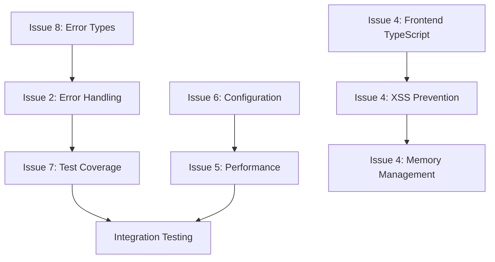

# Critical Issues Action Plan

## Executive Summary

This document provides a comprehensive action plan for addressing 6 critical issues identified in the LLM Dev Agent codebase. Each issue has been thoroughly analyzed with specific solutions, logging strategies, and implementation details.

**Issues Addressed:**
- Issue 2: Unsafe Error Handling 
- Issue 4: Frontend Architecture Issues
- Issue 5: Performance Bottlenecks
- Issue 6: Configuration Management Gaps
- Issue 7: Test Coverage Gaps
- Issue 8: Error Types Inconsistency

## Issue 2: Unsafe Error Handling

### Problem Analysis

**Critical Unsafe Patterns Found:**
1. **Mutex Panics**: `client.rs:121,140` - `.lock().unwrap()` on rate limiting mutex
2. **Silent Failures**: `main.rs:389` - Config loading falls back silently to defaults
3. **Production Panics**: 32+ unwrap() calls identified across codebase

### Technical Solutions

#### 2.1 Fix Mutex Lock Operations

**Current Unsafe Code:**
```rust
// src/claude/client.rs:121
let last_request = self.last_request.lock().unwrap();
```

**Safe Replacement:**
```rust
let last_request = self.last_request.lock()
    .map_err(|_| ClaudeError::ConfigError {
        message: "Rate limiter mutex poisoned - client state corrupted".to_string(),
        context: Some(ErrorContext::new("rate_limiting").add_metadata("operation", "lock_acquisition")),
    })?;
```

#### 2.2 Fix Silent Configuration Loading

**Current Unsafe Code:**
```rust
// src/main.rs:389
let app_config = AppConfig::load().unwrap_or_else(|e| {
    eprintln!("Failed to load app config: {}, using defaults", e);
    AppConfig::default()
});
```

**Safe Replacement:**
```rust
let app_config = match AppConfig::load() {
    Ok(config) => {
        log_info!("✅ Application configuration loaded successfully");
        config
    },
    Err(e) => {
        log_error!("🚨 CRITICAL: Failed to load app config: {}. Using defaults may cause unexpected behavior.", e);
        // Consider failing fast for critical config errors
        if e.is_critical() {
            return Err(format!("Cannot start application: {}", e));
        }
        AppConfig::default()
    }
};
```

#### 2.3 Production Error Handler Wrapper

**New Safe Error Handler:**
```rust
// src/claude/error.rs - Add production-safe wrapper
impl ClaudeError {
    /// Production-safe operation wrapper that logs and handles panics gracefully
    pub async fn handle_critical_operation<T, F, Fut>(
        operation_name: &str,
        operation: F,
    ) -> ClaudeResult<T>
    where
        F: FnOnce() -> Fut,
        Fut: std::future::Future<Output = ClaudeResult<T>>,
    {
        let start_time = std::time::Instant::now();
        
        match std::panic::catch_unwind(std::panic::AssertUnwindSafe(|| {
            tokio::runtime::Handle::current().block_on(operation())
        })) {
            Ok(result) => {
                let duration = start_time.elapsed();
                log_operation_success(operation_name, duration);
                result
            },
            Err(panic) => {
                let duration = start_time.elapsed();
                log_operation_panic(operation_name, duration, &panic);
                Err(ClaudeError::ConfigError {
                    message: format!("Critical operation '{}' panicked", operation_name),
                    context: Some(ErrorContext::new(operation_name)
                        .add_metadata("panic_recovered", "true")
                        .add_metadata("duration_ms", &duration.as_millis().to_string())),
                })
            }
        }
    }
}
```

### Logging Strategy for Error Handling

```rust
// Enhanced logging for error operations
fn log_operation_success(operation: &str, duration: Duration) {
    log::info!(
        target: "operation_success",
        operation = operation,
        duration_ms = duration.as_millis(),
        "Operation completed successfully"
    );
}

fn log_operation_panic(operation: &str, duration: Duration, panic_info: &dyn std::any::Any) {
    log::error!(
        target: "operation_panic",
        operation = operation,
        duration_ms = duration.as_millis(),
        panic_message = panic_info.downcast_ref::<String>()
            .map(|s| s.as_str())
            .or_else(|| panic_info.downcast_ref::<&str>().copied())
            .unwrap_or("Unknown panic"),
        "🚨 CRITICAL: Operation panicked and was recovered"
    );
}

fn log_mutex_contention(mutex_name: &str, wait_time: Duration) {
    log::warn!(
        target: "mutex_contention",
        mutex = mutex_name,
        wait_time_ms = wait_time.as_millis(),
        "Mutex contention detected - performance impact possible"
    );
}
```

## Issue 4: Frontend Architecture Issues

### Problem Analysis

**Critical Frontend Issues:**
1. **No TypeScript**: Vanilla JS with no type safety
2. **XSS Vulnerabilities**: innerHTML usage in app.js and ux-improvements.js
3. **Memory Leaks**: Event listeners not properly cleaned up
4. **No Input Validation**: User inputs not sanitized

### Technical Solutions

#### 4.1 TypeScript Migration Strategy

**Step 1: Add TypeScript Configuration**
```json
// tsconfig.json
{
  "compilerOptions": {
    "target": "ES2020",
    "module": "ESNext",
    "moduleResolution": "node",
    "strict": true,
    "esModuleInterop": true,
    "skipLibCheck": true,
    "forceConsistentCasingInFileNames": true,
    "declaration": true,
    "outDir": "./dist",
    "rootDir": "./src"
  },
  "include": ["ui/js/**/*"],
  "exclude": ["node_modules", "dist"]
}
```

**Step 2: Type Definitions for Tauri API**
```typescript
// ui/js/types/tauri.d.ts
declare global {
  interface Window {
    __TAURI__: {
      core: {
        invoke<T = any>(command: string, args?: Record<string, any>): Promise<T>;
      };
      event: {
        listen<T>(event: string, handler: (event: Event<T>) => void): Promise<UnlistenFn>;
      };
    };
  }
}

interface TauriCommand {
  'list_directory': (args: { path: string }) => Promise<FileItem[]>;
  'read_file': (args: { path: string }) => Promise<string>;
  'write_file': (args: { path: string; content: string }) => Promise<void>;
  'send_message_to_claude': (args: { message: string }) => Promise<string>;
}

type UnlistenFn = () => void;
```

#### 4.2 XSS Prevention and Safe DOM Manipulation

**Current Unsafe Code:**
```javascript
// Unsafe innerHTML usage
element.innerHTML = userContent;
item.innerHTML = `<span>${file.name}</span>`;
```

**Safe Replacement:**
```typescript
// Safe DOM manipulation utility
class SafeDOMUtils {
    static escapeHtml(text: string): string {
        const div = document.createElement('div');
        div.textContent = text;
        return div.innerHTML;
    }
    
    static createFileItem(file: FileItem): HTMLElement {
        const item = document.createElement('div');
        item.className = 'file-item';
        
        const icon = document.createElement('span');
        icon.className = 'file-icon';
        icon.textContent = file.icon;
        
        const name = document.createElement('span');
        name.className = 'file-name';
        name.textContent = file.name; // Safe - uses textContent
        
        item.appendChild(icon);
        item.appendChild(name);
        
        return item;
    }
    
    static setTextContent(element: HTMLElement, content: string): void {
        // Always use textContent for user data
        element.textContent = content;
    }
    
    static setSafeInnerHTML(element: HTMLElement, htmlContent: string): void {
        // Sanitize HTML content
        const sanitized = this.sanitizeHTML(htmlContent);
        element.innerHTML = sanitized;
    }
    
    private static sanitizeHTML(html: string): string {
        // Basic HTML sanitization - remove script tags and event handlers
        return html
            .replace(/<script\b[^<]*(?:(?!<\/script>)<[^<]*)*<\/script>/gi, '')
            .replace(/on\w+\s*=\s*"[^"]*"/gi, '')
            .replace(/on\w+\s*=\s*'[^']*'/gi, '')
            .replace(/javascript:/gi, '');
    }
}
```

#### 4.3 Memory Management and Event Cleanup

**Current Memory Leak Pattern:**
```javascript
document.addEventListener('keydown', handler); // Never cleaned up
observer.observe(element, options); // Never disconnected
```

**Safe Memory Management:**
```typescript
class MemoryManager {
    private eventListeners: Array<{
        element: EventTarget;
        event: string;
        handler: EventListener;
    }> = [];
    
    private observers: Array<MutationObserver | IntersectionObserver> = [];
    
    addEventListener(
        element: EventTarget, 
        event: string, 
        handler: EventListener, 
        options?: AddEventListenerOptions
    ): void {
        element.addEventListener(event, handler, options);
        this.eventListeners.push({ element, event, handler });
    }
    
    addObserver(observer: MutationObserver | IntersectionObserver): void {
        this.observers.push(observer);
    }
    
    cleanup(): void {
        // Remove all event listeners
        this.eventListeners.forEach(({ element, event, handler }) => {
            element.removeEventListener(event, handler);
        });
        this.eventListeners = [];
        
        // Disconnect all observers
        this.observers.forEach(observer => observer.disconnect());
        this.observers = [];
    }
}

// Usage in DevAgentApp
class DevAgentApp {
    private memoryManager = new MemoryManager();
    
    setupEventListeners(): void {
        this.memoryManager.addEventListener(
            this.chatForm, 
            'submit', 
            (e) => this.handleSendMessage(e)
        );
    }
    
    destroy(): void {
        this.memoryManager.cleanup();
    }
}
```

### Logging Strategy for Frontend

```typescript
// Frontend logging utility
class FrontendLogger {
    static logError(operation: string, error: Error, context?: Record<string, any>): void {
        const logData = {
            timestamp: new Date().toISOString(),
            level: 'ERROR',
            operation,
            message: error.message,
            stack: error.stack,
            context: context || {},
            userAgent: navigator.userAgent,
            url: window.location.href
        };
        
        console.error('🚨 Frontend Error:', logData);
        
        // Send to Tauri backend for centralized logging
        if (window.__TAURI__) {
            window.__TAURI__.core.invoke('log_frontend_error', { logData })
                .catch(err => console.error('Failed to log to backend:', err));
        }
    }
    
    static logPerformance(operation: string, duration: number, metadata?: Record<string, any>): void {
        const logData = {
            timestamp: new Date().toISOString(),
            level: 'PERFORMANCE',
            operation,
            duration_ms: duration,
            metadata: metadata || {}
        };
        
        console.log('⚡ Performance:', logData);
    }
    
    static logMemoryUsage(): void {
        if ('memory' in performance) {
            const memory = (performance as any).memory;
            const logData = {
                timestamp: new Date().toISOString(),
                level: 'MEMORY',
                usedJSHeapSize: memory.usedJSHeapSize,
                totalJSHeapSize: memory.totalJSHeapSize,
                jsHeapSizeLimit: memory.jsHeapSizeLimit
            };
            
            console.log('🧠 Memory Usage:', logData);
        }
    }
}
```

## Issue 5: Performance Bottlenecks

### Problem Analysis

**Performance Issues Identified:**
1. **Two-step API Process**: Correct architecture but slow (2x latency)
2. **Excessive Cloning**: 98+ clone operations throughout codebase
3. **Inefficient File I/O**: No pagination for large directories
4. **Large Binary Size**: 298MB debug binary

### Technical Solutions

#### 5.1 Two-Step API Process Optimization

**Current Implementation Analysis:**
The two-step process is architecturally correct for tool execution:
1. Send message with tools → Claude responds with tool_use
2. Execute tools → Send results back → Claude provides final response

**Optimization Strategy (Maintaining Correctness):**

⚠️ **Important Note**: Request-level caching is NOT suitable for Claude API because:
- Each request contains growing conversation history (messages array)
- Context always changes between requests
- Temperature introduces randomness even for identical inputs

**Realistic Performance Optimizations:**
```rust
// src/claude/client.rs - Optimized with connection reuse and request batching
impl ClaudeClient {
    // Focus on connection optimization, not response caching
    async fn make_api_call_optimized(&self, request: ClaudeRequest) -> ClaudeResult<ClaudeResponse> {
        let start_time = std::time::Instant::now();
        
        // 1. Connection reuse with keep-alive (this is appropriate)
        let response = self.http_client
            .post(constants::claude_messages_url())
            .header("x-api-key", &self.config.api_key)
            .header("anthropic-version", constants::CLAUDE_API_VERSION)
            .header("content-type", "application/json")
            .header("connection", "keep-alive") // Reuse TCP connections
            .header("keep-alive", "timeout=60, max=100") // Connection pool optimization
            .json(&request)
            .send()
            .await?;
            
        // 2. Process response without caching (inappropriate for conversational AI)
        if response.status().is_success() {
            let claude_response: ClaudeResponse = response.json().await?;
            
            let duration = start_time.elapsed();
            log_api_performance("claude_api_call", duration, request.messages.len());
            
            Ok(claude_response)
        } else {
            let status = response.status();
            let error_body = response.text().await.unwrap_or_default();
            log_api_error("claude_api_call", status.as_u16(), &error_body, start_time.elapsed());
            
            Err(ClaudeError::ApiError {
                status: status.as_u16(),
                message: error_body,
                error_type: None,
                param: None,
                context: Some(ErrorContext::new("api_call_failed")),
            })
        }
    }
    
    // Parallel tool execution optimization (this IS appropriate)
    async fn execute_tools_parallel(&self, tool_uses: Vec<ToolUse>) -> Vec<ToolResult> {
        let mut tasks = Vec::new();
        
        for tool_use in tool_uses {
            let context = self.create_execution_context(&tool_use);
            let task = tokio::spawn(async move {
                self.tool_execution_engine
                    .execute_single_tool(tool_use.into_request(), context)
                    .await
            });
            tasks.push(task);
        }
        
        // Execute all tools in parallel, collect results
        futures::future::join_all(tasks)
            .await
            .into_iter()
            .map(|result| result.unwrap_or_else(|_| /* handle join error */))
            .collect()
    }
}

// What CAN be cached appropriately:
impl PerformanceOptimizations {
    // 1. File system operations caching (appropriate)
    async fn cached_directory_listing(&self, path: &str) -> ClaudeResult<Vec<FileItem>> {
        let cache_key = format!("dir_listing:{}", path);
        
        if let Some(cached) = self.file_cache.get(&cache_key).await {
            if cached.is_fresh(Duration::from_secs(30)) { // 30 second TTL for directory listings
                log_cache_hit("directory_listing", cached.age());
                return Ok(cached.data);
            }
        }
        
        // Cache miss - load from filesystem
        let items = self.load_directory_items(path).await?;
        self.file_cache.set(&cache_key, items.clone(), Duration::from_secs(30)).await;
        
        Ok(items)
    }
    
    // 2. Tool metadata caching (appropriate)
    async fn cached_tool_definitions(&self) -> Vec<ToolDefinition> {
        // Tool definitions don't change during runtime, safe to cache
        if let Some(cached) = &self.tool_definitions_cache {
            return cached.clone();
        }
        
        let definitions = self.load_tool_definitions();
        self.tool_definitions_cache = Some(definitions.clone());
        definitions
    }
    
    // 3. Configuration validation caching (appropriate)
    async fn cached_config_validation(&self, config_hash: u64) -> bool {
        // Same config hash = same validation result
        if let Some(result) = self.validation_cache.get(&config_hash) {
            return *result;
        }
        
        let is_valid = self.validate_configuration().await;
        self.validation_cache.insert(config_hash, is_valid);
        is_valid
    }
}
```

#### 5.2 Clone Operation Reduction

**Analysis of Clone Sources:**
- Conversation message cloning in `client.rs:320-330`
- Tool execution context cloning
- Configuration cloning in multiple locations

**Optimization Solutions:**
```rust
// Use Arc for shared immutable data
use std::sync::Arc;

// Instead of cloning large conversation data
impl ClaudeClient {
    fn conversation_to_claude_messages_optimized(&self, conversation: &Conversation) -> Vec<ClaudeMessage> {
        // Use references where possible, only clone when necessary
        conversation
            .messages
            .iter()
            .map(|msg| ClaudeMessage {
                role: msg.role, // Copy enum (cheap)
                content: Arc::clone(&msg.content), // Share content via Arc
                thinking: msg.thinking.as_ref().map(Arc::clone), // Share thinking via Arc
            })
            .collect()
    }
}

// Shared configuration pattern
#[derive(Clone)]
pub struct SharedClaudeConfig {
    inner: Arc<ClaudeConfigInner>,
}

impl SharedClaudeConfig {
    pub fn new(config: ClaudeConfig) -> Self {
        Self {
            inner: Arc::new(ClaudeConfigInner::from(config)),
        }
    }
    
    // Cheap clones via Arc
    pub fn clone_shared(&self) -> Self {
        Self {
            inner: Arc::clone(&self.inner),
        }
    }
}
```

#### 5.3 File I/O Optimization

**Current Issue: No Pagination**
```rust
// src/claude/tools/mod.rs - Large directory handling
const MAX_ENTRIES: usize = 1000; // Hard limit, no pagination
```

**Optimized Solution:**
```rust
// Streaming directory listing with pagination
#[derive(Serialize, Deserialize)]
pub struct DirectoryPage {
    pub entries: Vec<FileItem>,
    pub total_count: usize,
    pub page: usize,
    pub has_more: bool,
    pub next_token: Option<String>,
}

async fn list_directory_paginated(
    path: String,
    page_size: Option<usize>,
    page_token: Option<String>,
) -> ClaudeResult<DirectoryPage> {
    let page_size = page_size.unwrap_or(100).min(1000); // Reasonable default
    
    let mut entries = tokio::fs::read_dir(&path).await?;
    let mut results = Vec::with_capacity(page_size);
    let mut total_count = 0;
    
    // Skip to page position if token provided
    let skip_count = parse_page_token(&page_token)?;
    
    while let Some(entry) = entries.next_entry().await? {
        total_count += 1;
        
        if total_count <= skip_count {
            continue;
        }
        
        if results.len() >= page_size {
            break;
        }
        
        let file_item = create_file_item(entry).await?;
        results.push(file_item);
    }
    
    let has_more = results.len() == page_size;
    let next_token = if has_more {
        Some(create_page_token(skip_count + results.len()))
    } else {
        None
    };
    
    log_directory_access(&path, results.len(), total_count, has_more);
    
    Ok(DirectoryPage {
        entries: results,
        total_count,
        page: skip_count / page_size + 1,
        has_more,
        next_token,
    })
}
```

### Performance Logging Strategy

```rust
// Performance monitoring and logging
fn log_api_performance(operation: &str, duration: Duration, message_count: usize) {
    log::info!(
        target: "api_performance",
        operation = operation,
        duration_ms = duration.as_millis(),
        message_count = message_count,
        throughput_msg_per_sec = if duration.as_secs() > 0 { 
            message_count as u64 / duration.as_secs() 
        } else { 
            message_count as u64 
        },
        "API call performance metrics"
    );
    
    // Alert on slow performance
    if duration > Duration::from_secs(10) {
        log::warn!(
            target: "performance_alert",
            operation = operation,
            duration_ms = duration.as_millis(),
            "🐌 Slow API performance detected"
        );
    }
}

fn log_cache_hit(cache_type: &str, cache_age: Duration) {
    log::debug!(
        target: "cache_performance",
        cache_type = cache_type,
        cache_age_seconds = cache_age.as_secs(),
        "Cache hit - served from cache"
    );
}

fn log_api_error(operation: &str, status_code: u16, error_body: &str, duration: Duration) {
    log::error!(
        target: "api_error",
        operation = operation,
        status_code = status_code,
        error_body = error_body,
        duration_ms = duration.as_millis(),
        "API call failed"
    );
}

fn log_memory_allocation(operation: &str, allocation_size: usize, allocation_count: usize) {
    log::debug!(
        target: "memory_performance",
        operation = operation,
        allocation_size_bytes = allocation_size,
        allocation_count = allocation_count,
        "Memory allocation metrics"
    );
}
```

## Issue 6: Configuration Management Gaps

### Problem Analysis

**Hardcoded Values Found:**
1. **API URL**: `https://api.anthropic.com/v1/messages` in client.rs:146
2. **Timeouts**: `Duration::from_secs(120)` in client.rs:32
3. **User Agent**: `"LLMDevAgent/0.1.0"` in client.rs:33
4. **Rate Limits**: `Duration::from_secs(1)` in client.rs:124
5. **File Limits**: Various size limits in tools/mod.rs

### Technical Solutions

#### 6.1 Centralized Configuration System

**Configuration File Structure:**
```toml
# config/app.toml
[app]
name = "LLM Dev Agent"
version = "0.1.0"

[api]
base_url = "https://api.anthropic.com/v1"
messages_endpoint = "/messages"
version = "2023-06-01"
timeout_seconds = 120
user_agent = "LLMDevAgent/0.1.0"
rate_limit_seconds = 1

[performance]
http_connection_pool_size = 10
request_cache_ttl_seconds = 300
max_parallel_tools = 5

[file_operations]
max_file_size_bytes = 10485760  # 10MB
max_directory_entries = 1000
page_size_default = 100

[security]
enable_request_logging = true
sanitize_error_logs = true
max_retry_attempts = 3

[development]
debug_mode = false
verbose_logging = false
enable_performance_monitoring = true
```

**Configuration Loading Implementation:**
```rust
// src/config/mod.rs - Enhanced configuration system
use serde::{Deserialize, Serialize};
use std::path::PathBuf;

#[derive(Debug, Clone, Serialize, Deserialize)]
pub struct AppConfig {
    pub app: AppMetadata,
    pub api: ApiConfig,
    pub performance: PerformanceConfig,
    pub file_operations: FileOperationConfig,
    pub security: SecurityConfig,
    pub development: DevelopmentConfig,
}

impl AppConfig {
    pub fn load() -> anyhow::Result<Self> {
        // Priority order: Environment → File → Defaults
        let mut config = Self::default();
        
        // 1. Load from file if exists
        if let Ok(file_config) = Self::load_from_file() {
            config = Self::merge_configs(config, file_config)?;
            log_config_source("file", "config/app.toml");
        }
        
        // 2. Override with environment variables
        if let Ok(env_config) = Self::load_from_env() {
            config = Self::merge_configs(config, env_config)?;
            log_config_source("environment", "environment variables");
        }
        
        // 3. Validate final configuration
        config.validate()?;
        
        log_config_loaded(&config);
        Ok(config)
    }
    
    fn load_from_file() -> anyhow::Result<Self> {
        let config_path = Self::get_config_path()?;
        let content = std::fs::read_to_string(&config_path)
            .with_context(|| format!("Failed to read config file: {}", config_path.display()))?;
        
        let config: Self = toml::from_str(&content)
            .with_context(|| format!("Failed to parse config file: {}", config_path.display()))?;
        
        Ok(config)
    }
    
    fn get_config_path() -> anyhow::Result<PathBuf> {
        // Check multiple locations
        let candidates = [
            "config/app.toml",
            "app.toml",
            "~/.config/llm-dev-agent/app.toml",
        ];
        
        for candidate in &candidates {
            let path = PathBuf::from(candidate);
            if path.exists() {
                return Ok(path);
            }
        }
        
        anyhow::bail!("No configuration file found in expected locations: {:?}", candidates);
    }
    
    fn validate(&self) -> anyhow::Result<()> {
        // Validate configuration consistency
        if self.api.timeout_seconds == 0 {
            anyhow::bail!("API timeout cannot be zero");
        }
        
        if self.file_operations.max_file_size_bytes == 0 {
            anyhow::bail!("Max file size cannot be zero");
        }
        
        if !self.api.base_url.starts_with("https://") {
            log::warn!("API base URL is not HTTPS - this may be insecure");
        }
        
        Ok(())
    }
}

#[derive(Debug, Clone, Serialize, Deserialize)]
pub struct ApiConfig {
    pub base_url: String,
    pub messages_endpoint: String,
    pub version: String,
    pub timeout_seconds: u64,
    pub user_agent: String,
    pub rate_limit_seconds: u64,
}

impl ApiConfig {
    pub fn messages_url(&self) -> String {
        format!("{}{}", self.base_url, self.messages_endpoint)
    }
    
    pub fn timeout_duration(&self) -> Duration {
        Duration::from_secs(self.timeout_seconds)
    }
    
    pub fn rate_limit_duration(&self) -> Duration {
        Duration::from_secs(self.rate_limit_seconds)
    }
}
```

#### 6.2 Environment-Specific Configuration

**Environment Override System:**
```rust
impl AppConfig {
    fn load_from_env() -> anyhow::Result<Self> {
        use std::env;
        
        let mut config = Self::default();
        
        // API configuration from environment
        if let Ok(api_key) = env::var("CLAUDE_API_KEY") {
            config.api.api_key = Some(api_key);
        }
        
        if let Ok(base_url) = env::var("CLAUDE_API_BASE_URL") {
            config.api.base_url = base_url;
        }
        
        if let Ok(timeout) = env::var("CLAUDE_API_TIMEOUT_SECONDS") {
            config.api.timeout_seconds = timeout.parse()
                .with_context(|| "Invalid CLAUDE_API_TIMEOUT_SECONDS value")?;
        }
        
        // Development configuration
        if let Ok(debug) = env::var("DEBUG") {
            config.development.debug_mode = debug.parse().unwrap_or(false);
        }
        
        if let Ok(verbose) = env::var("VERBOSE_LOGGING") {
            config.development.verbose_logging = verbose.parse().unwrap_or(false);
        }
        
        Ok(config)
    }
}
```

### Configuration Logging Strategy

```rust
fn log_config_source(source: &str, location: &str) {
    log::info!(
        target: "config_loading",
        source = source,
        location = location,
        "Configuration loaded from source"
    );
}

fn log_config_loaded(config: &AppConfig) {
    log::info!(
        target: "config_loaded",
        api_base_url = config.api.base_url,
        timeout_seconds = config.api.timeout_seconds,
        debug_mode = config.development.debug_mode,
        max_file_size = config.file_operations.max_file_size_bytes,
        "✅ Application configuration validated and loaded"
    );
}

fn log_config_change(field: &str, old_value: &str, new_value: &str, source: &str) {
    log::info!(
        target: "config_change",
        field = field,
        old_value = old_value,
        new_value = new_value,
        source = source,
        "Configuration value changed"
    );
}
```

## Issue 7: Test Coverage Gaps

### Problem Analysis

**Missing Test Coverage:**
- 11 of 21 files (52%) have no tests
- Critical modules untested: `client.rs`, `config/validation.rs`, `main.rs`
- No integration tests for end-to-end workflows
- No frontend test suite

### Technical Solutions

#### 7.1 Critical Module Test Implementation

**Claude Client Tests:**
```rust
// src/claude/client.rs - Add comprehensive test module
#[cfg(test)]
mod tests {
    use super::*;
    use std::sync::Arc;
    use tokio::sync::RwLock;
    use mockall::{predicate::*, mock};
    
    // Mock HTTP client for testing
    mock! {
        pub HttpClient {}
        
        impl Clone for HttpClient {
            fn clone(&self) -> Self;
        }
        
        #[async_trait]
        impl HttpClientTrait for HttpClient {
            async fn post(&self, url: &str) -> Result<MockResponse, reqwest::Error>;
        }
    }
    
    #[tokio::test]
    async fn test_send_message_success() {
        let config = create_test_config();
        let mut mock_client = MockHttpClient::new();
        
        // Setup mock expectations
        mock_client
            .expect_post()
            .with(eq("https://api.anthropic.com/v1/messages"))
            .times(1)
            .returning(|_| Ok(create_mock_response()));
        
        let client = ClaudeClient::new_with_http_client(config, mock_client)?;
        let conversation = Conversation::new();
        
        let result = client.send_message(&conversation, "Hello".to_string()).await;
        
        assert!(result.is_ok());
        let response = result.unwrap();
        assert!(!response.is_empty());
        
        // Log test completion
        log_test_completion("send_message_success", true, None);
    }
    
    #[tokio::test]
    async fn test_rate_limiting() {
        let config = create_test_config();
        let client = ClaudeClient::new(config)?;
        let conversation = Conversation::new();
        
        let start_time = std::time::Instant::now();
        
        // Make two rapid requests
        let _result1 = client.send_message(&conversation, "First".to_string()).await;
        let _result2 = client.send_message(&conversation, "Second".to_string()).await;
        
        let elapsed = start_time.elapsed();
        
        // Should be rate limited to at least 1 second between requests
        assert!(elapsed >= Duration::from_secs(1));
        
        log_test_completion("rate_limiting", true, Some(format!("elapsed_ms: {}", elapsed.as_millis())));
    }
    
    #[tokio::test]
    async fn test_mutex_lock_failure_recovery() {
        // Test mutex poisoning recovery
        let config = create_test_config();
        let client = ClaudeClient::new(config)?;
        
        // Simulate mutex poisoning scenario
        // This is a challenging test - may need custom mutex wrapper for testability
        
        // Test that client recovers gracefully from mutex issues
        let result = client.send_message(&Conversation::new(), "Test".to_string()).await;
        
        // Should handle mutex issues gracefully
        match result {
            Ok(_) => log_test_completion("mutex_recovery", true, None),
            Err(ClaudeError::ConfigError { message, .. }) if message.contains("mutex") => {
                log_test_completion("mutex_recovery", true, Some("Graceful mutex error handling"));
            }
            Err(e) => {
                log_test_completion("mutex_recovery", false, Some(format!("Unexpected error: {}", e)));
                panic!("Unexpected error type: {}", e);
            }
        }
    }
    
    fn create_test_config() -> ClaudeConfig {
        ClaudeConfig {
            api_key: "test-key".to_string(),
            model: "claude-3-sonnet-20240229".to_string(),
            max_tokens: 1000,
            temperature: 0.7,
            model_registry: crate::claude::ModelRegistry::new(),
        }
    }
}
```

#### 7.2 Integration Test Suite

**End-to-End Workflow Tests:**
```rust
// tests/integration_tests.rs - New integration test file
use rustic_agent::{AppState, claude::{ClaudeClient, ClaudeConfig, Conversation}};
use std::sync::Arc;
use tokio::sync::{Mutex, RwLock};

#[tokio::test]
async fn test_complete_file_operation_workflow() {
    let test_start = std::time::Instant::now();
    
    // Setup test environment
    let app_state = create_test_app_state().await;
    
    // Test complete workflow: List → Read → Modify → Write
    let workflow_steps = vec![
        "List files in current directory",
        "Read a specific file",
        "Modify the file content",
        "Write the modified content back",
    ];
    
    for (step_index, step_description) in workflow_steps.iter().enumerate() {
        let step_start = std::time::Instant::now();
        
        let result = match step_index {
            0 => test_list_directory(&app_state).await,
            1 => test_read_file(&app_state).await,
            2 => test_modify_content(&app_state).await,
            3 => test_write_file(&app_state).await,
            _ => unreachable!(),
        };
        
        let step_duration = step_start.elapsed();
        
        match result {
            Ok(output) => {
                log_integration_test_step(
                    "file_operation_workflow",
                    step_index + 1,
                    step_description,
                    true,
                    step_duration,
                    Some(&output)
                );
            }
            Err(e) => {
                log_integration_test_step(
                    "file_operation_workflow",
                    step_index + 1,
                    step_description,
                    false,
                    step_duration,
                    Some(&e.to_string())
                );
                panic!("Integration test failed at step {}: {}", step_index + 1, e);
            }
        }
    }
    
    let total_duration = test_start.elapsed();
    log_integration_test_complete("file_operation_workflow", true, total_duration);
}

#[tokio::test]
async fn test_error_recovery_workflow() {
    // Test that system recovers gracefully from various error conditions
    let test_scenarios = vec![
        ("invalid_file_path", test_invalid_file_access),
        ("network_timeout", test_network_timeout_recovery),
        ("malformed_api_response", test_malformed_response_handling),
        ("rate_limit_exceeded", test_rate_limit_handling),
    ];
    
    for (scenario_name, test_fn) in test_scenarios {
        let scenario_start = std::time::Instant::now();
        
        let result = test_fn().await;
        let scenario_duration = scenario_start.elapsed();
        
        log_integration_test_scenario(scenario_name, result.is_ok(), scenario_duration, &result);
        
        // Error recovery tests should handle errors gracefully, not panic
        if let Err(e) = result {
            if !is_expected_test_error(&e) {
                panic!("Unexpected error in scenario {}: {}", scenario_name, e);
            }
        }
    }
}

async fn create_test_app_state() -> AppState {
    // Create isolated test environment
    AppState {
        conversation: Arc::new(Mutex::new(Conversation::new())),
        config: Arc::new(Mutex::new(create_test_claude_config())),
        app_config: Arc::new(create_test_app_config()),
        whitelist: Arc::new(RwLock::new(create_test_whitelist_config())),
        file_watcher: Arc::new(create_test_file_watcher()),
    }
}
```

#### 7.3 Frontend Test Suite

**TypeScript Frontend Tests:**
```typescript
// ui/tests/app.test.ts - Frontend test suite
import { DevAgentApp } from '../js/app';
import { MemoryManager } from '../js/memory-manager';
import { SafeDOMUtils } from '../js/safe-dom-utils';

describe('DevAgentApp', () => {
    let app: DevAgentApp;
    let mockTauri: any;
    
    beforeEach(() => {
        // Setup DOM
        document.body.innerHTML = `
            <div id="chatMessages"></div>
            <input id="chatInput" />
            <form id="chatForm"></form>
            <button id="sendBtn"></button>
            <div id="loadingOverlay"></div>
            <div id="fileTree"></div>
        `;
        
        // Mock Tauri API
        mockTauri = {
            core: {
                invoke: jest.fn()
            },
            event: {
                listen: jest.fn()
            }
        };
        
        (global as any).window.__TAURI__ = mockTauri;
        
        app = new DevAgentApp();
    });
    
    afterEach(() => {
        app.destroy();
        jest.clearAllMocks();
    });
    
    test('should initialize without errors', () => {
        expect(app).toBeDefined();
        expect(app.chatMessages).toBeDefined();
        expect(app.chatInput).toBeDefined();
    });
    
    test('should handle send message safely', async () => {
        const testMessage = 'Hello, World!';
        const mockResponse = 'Hello! How can I help you?';
        
        mockTauri.core.invoke.mockResolvedValue(mockResponse);
        
        app.chatInput.value = testMessage;
        
        const startTime = performance.now();
        await app.handleSendMessage();
        const duration = performance.now() - startTime;
        
        expect(mockTauri.core.invoke).toHaveBeenCalledWith(
            'send_message_to_claude',
            { message: testMessage }
        );
        
        // Log test performance
        console.log(`Frontend test performance: ${duration}ms`);
        
        // Verify UI state
        expect(app.chatInput.value).toBe(''); // Input should be cleared
        expect(app.isProcessing).toBe(false); // Should not be processing
    });
    
    test('should prevent XSS attacks', () => {
        const maliciousContent = '<script>alert("XSS")</script>';
        const safeContent = SafeDOMUtils.escapeHtml(maliciousContent);
        
        expect(safeContent).not.toContain('<script>');
        expect(safeContent).not.toContain('onerror');
        expect(safeContent).not.toContain('javascript:');
        
        // Verify DOM manipulation is safe
        const element = document.createElement('div');
        SafeDOMUtils.setTextContent(element, maliciousContent);
        
        expect(element.innerHTML).not.toContain('<script>');
    });
    
    test('should clean up memory properly', () => {
        const memoryManager = new MemoryManager();
        const element = document.createElement('div');
        const handler = jest.fn();
        
        memoryManager.addEventListener(element, 'click', handler);
        
        // Verify event listener is added
        element.click();
        expect(handler).toHaveBeenCalled();
        
        // Clean up
        memoryManager.cleanup();
        handler.mockClear();
        
        // Verify event listener is removed
        element.click();
        expect(handler).not.toHaveBeenCalled();
    });
});
```

### Test Logging Strategy

```rust
fn log_test_completion(test_name: &str, success: bool, metadata: Option<String>) {
    log::info!(
        target: "test_execution",
        test_name = test_name,
        success = success,
        metadata = metadata.unwrap_or_default(),
        "Unit test completed"
    );
}

fn log_integration_test_step(
    workflow: &str,
    step: usize,
    description: &str,
    success: bool,
    duration: Duration,
    output: Option<&str>
) {
    log::info!(
        target: "integration_test",
        workflow = workflow,
        step = step,
        description = description,
        success = success,
        duration_ms = duration.as_millis(),
        output = output.unwrap_or(""),
        "Integration test step completed"
    );
}

fn log_test_coverage_report(
    total_files: usize,
    tested_files: usize,
    coverage_percentage: f32,
    missing_tests: &[String]
) {
    log::info!(
        target: "test_coverage",
        total_files = total_files,
        tested_files = tested_files,
        coverage_percentage = coverage_percentage,
        missing_tests = ?missing_tests,
        "Test coverage report generated"
    );
}
```

## Issue 8: Error Types Inconsistency

### Problem Analysis

**Mixed Error Types Found:**
- `anyhow::Result` used in configuration loading
- `ClaudeResult<T>` used in Claude operations
- `Result<T, String>` used in Tauri commands
- No consistent error conversion strategy

### Technical Solutions

#### 8.1 Unified Error System Design

**Standardized Error Hierarchy:**
```rust
// src/claude/error.rs - Enhanced unified error system
use serde::{Deserialize, Serialize};
use thiserror::Error;

/// Unified error type for the entire application
#[derive(Debug, Error, Clone, Serialize, Deserialize)]
pub enum UnifiedError {
    #[error("Claude API error: {message}")]
    Claude {
        message: String,
        error_code: Option<String>,
        context: Option<ErrorContext>,
    },
    
    #[error("Configuration error: {message}")]
    Configuration {
        message: String,
        config_path: Option<String>,
        context: Option<ErrorContext>,
    },
    
    #[error("File operation error: {message}")]
    FileOperation {
        message: String,
        file_path: Option<String>,
        operation: String,
        context: Option<ErrorContext>,
    },
    
    #[error("Network error: {message}")]
    Network {
        message: String,
        url: Option<String>,
        status_code: Option<u16>,
        context: Option<ErrorContext>,
    },
    
    #[error("Validation error: {message}")]
    Validation {
        message: String,
        field: Option<String>,
        expected: Option<String>,
        actual: Option<String>,
        context: Option<ErrorContext>,
    },
    
    #[error("Internal error: {message}")]
    Internal {
        message: String,
        source: Option<String>,
        context: Option<ErrorContext>,
    },
}

/// Unified result type for the entire application
pub type AppResult<T> = Result<T, UnifiedError>;

impl UnifiedError {
    /// Create a new error with context
    pub fn with_context(mut self, context: ErrorContext) -> Self {
        match &mut self {
            UnifiedError::Claude { context: ref mut c, .. } => *c = Some(context),
            UnifiedError::Configuration { context: ref mut c, .. } => *c = Some(context),
            UnifiedError::FileOperation { context: ref mut c, .. } => *c = Some(context),
            UnifiedError::Network { context: ref mut c, .. } => *c = Some(context),
            UnifiedError::Validation { context: ref mut c, .. } => *c = Some(context),
            UnifiedError::Internal { context: ref mut c, .. } => *c = Some(context),
        }
        self
    }
    
    /// Get error category for logging and monitoring
    pub fn category(&self) -> &'static str {
        match self {
            UnifiedError::Claude { .. } => "claude",
            UnifiedError::Configuration { .. } => "configuration",
            UnifiedError::FileOperation { .. } => "file_operation",
            UnifiedError::Network { .. } => "network",
            UnifiedError::Validation { .. } => "validation",
            UnifiedError::Internal { .. } => "internal",
        }
    }
    
    /// Check if error is retryable
    pub fn is_retryable(&self) -> bool {
        match self {
            UnifiedError::Network { status_code: Some(code), .. } => {
                matches!(code, 429 | 500 | 502 | 503 | 504)
            },
            UnifiedError::Claude { error_code: Some(code), .. } => {
                code == "rate_limit_error" || code == "server_error"
            },
            UnifiedError::FileOperation { .. } => false, // Usually not retryable
            UnifiedError::Configuration { .. } => false, // Usually not retryable
            UnifiedError::Validation { .. } => false, // Never retryable
            UnifiedError::Internal { .. } => false, // Usually not retryable
            _ => false,
        }
    }
    
    /// Convert to frontend-safe error (removes sensitive information)
    pub fn to_frontend_safe(&self) -> FrontendError {
        FrontendError {
            category: self.category().to_string(),
            message: self.sanitize_message(),
            code: self.get_error_code(),
            retryable: self.is_retryable(),
        }
    }
    
    fn sanitize_message(&self) -> String {
        let message = self.to_string();
        // Remove sensitive paths and information
        message
            .replace(&std::env::var("HOME").unwrap_or_default(), "[USER_HOME]")
            .replace("sk-ant-", "[API_KEY_PREFIX]")
    }
    
    fn get_error_code(&self) -> Option<String> {
        match self {
            UnifiedError::Claude { error_code, .. } => error_code.clone(),
            UnifiedError::Network { status_code, .. } => status_code.map(|c| c.to_string()),
            _ => None,
        }
    }
}
```

#### 8.2 Error Conversion Strategy

**From Legacy Error Types:**
```rust
// Conversion from existing error types
impl From<anyhow::Error> for UnifiedError {
    fn from(err: anyhow::Error) -> Self {
        UnifiedError::Internal {
            message: err.to_string(),
            source: Some("anyhow".to_string()),
            context: Some(ErrorContext::new("error_conversion")),
        }
    }
}

impl From<ClaudeError> for UnifiedError {
    fn from(err: ClaudeError) -> Self {
        match err {
            ClaudeError::ApiError { status, message, error_type, context, .. } => {
                UnifiedError::Claude {
                    message,
                    error_code: error_type,
                    context,
                }
            },
            ClaudeError::ConfigError { message, context } => {
                UnifiedError::Configuration {
                    message,
                    config_path: None,
                    context,
                }
            },
            ClaudeError::ValidationError { message, context } => {
                UnifiedError::Validation {
                    message,
                    field: None,
                    expected: None,
                    actual: None,
                    context,
                }
            },
            ClaudeError::HttpError(http_err) => {
                UnifiedError::Network {
                    message: http_err.to_string(),
                    url: None,
                    status_code: None,
                    context: Some(ErrorContext::new("http_error")),
                }
            },
            _ => UnifiedError::Internal {
                message: err.to_string(),
                source: Some("claude_error".to_string()),
                context: Some(ErrorContext::new("claude_error_conversion")),
            },
        }
    }
}

impl From<std::io::Error> for UnifiedError {
    fn from(err: std::io::Error) -> Self {
        UnifiedError::FileOperation {
            message: err.to_string(),
            file_path: None,
            operation: "unknown".to_string(),
            context: Some(ErrorContext::new("io_error")),
        }
    }
}

// For Tauri commands - convert to String
impl From<UnifiedError> for String {
    fn from(err: UnifiedError) -> Self {
        err.to_frontend_safe().to_json()
    }
}
```

#### 8.3 Frontend Error Handling

**Frontend-Safe Error Type:**
```typescript
// Frontend error type matching Rust definition
interface FrontendError {
    category: string;
    message: string;
    code?: string;
    retryable: boolean;
}

class ErrorHandler {
    static handleError(error: FrontendError): void {
        const errorId = this.generateErrorId();
        
        // Log error
        console.error(`[${errorId}] ${error.category.toUpperCase()}: ${error.message}`, {
            code: error.code,
            retryable: error.retryable,
            timestamp: new Date().toISOString()
        });
        
        // Show user-friendly message
        this.showUserError(error, errorId);
        
        // Send to backend for centralized logging
        if (window.__TAURI__) {
            window.__TAURI__.core.invoke('log_frontend_error', {
                error,
                errorId,
                userAgent: navigator.userAgent,
                url: window.location.href
            }).catch(logErr => {
                console.error('Failed to send error to backend:', logErr);
            });
        }
    }
    
    static showUserError(error: FrontendError, errorId: string): void {
        const userMessage = this.getUserFriendlyMessage(error);
        const retryButton = error.retryable ? 'Try Again' : null;
        
        // Show notification or modal with user-friendly message
        this.showNotification({
            type: 'error',
            message: userMessage,
            errorId,
            retryButton,
            duration: error.retryable ? 0 : 5000 // Persistent if retryable
        });
    }
    
    private static getUserFriendlyMessage(error: FrontendError): string {
        switch (error.category) {
            case 'claude':
                return 'Communication with AI service failed. Please check your connection and try again.';
            case 'network':
                return 'Network connection issue. Please check your internet connection.';
            case 'configuration':
                return 'Configuration error. Please check your settings.';
            case 'file_operation':
                return 'File operation failed. Please check file permissions and try again.';
            case 'validation':
                return 'Input validation failed. Please check your input and try again.';
            default:
                return 'An unexpected error occurred. Please try again or contact support.';
        }
    }
}
```

### Error Logging Strategy

```rust
// Comprehensive error logging
impl UnifiedError {
    pub fn log_error(&self) {
        let error_id = uuid::Uuid::new_v4().to_string();
        
        match self {
            UnifiedError::Claude { message, error_code, context } => {
                log::error!(
                    target: "error_claude",
                    error_id = error_id,
                    message = message,
                    error_code = error_code.as_deref().unwrap_or("unknown"),
                    context = ?context,
                    "Claude API error occurred"
                );
            },
            UnifiedError::Network { message, url, status_code, context } => {
                log::error!(
                    target: "error_network",
                    error_id = error_id,
                    message = message,
                    url = url.as_deref().unwrap_or("unknown"),
                    status_code = status_code.unwrap_or(0),
                    context = ?context,
                    "Network error occurred"
                );
            },
            UnifiedError::FileOperation { message, file_path, operation, context } => {
                log::error!(
                    target: "error_file_operation",
                    error_id = error_id,
                    message = message,
                    file_path = file_path.as_deref().unwrap_or("unknown"),
                    operation = operation,
                    context = ?context,
                    "File operation error occurred"
                );
            },
            _ => {
                log::error!(
                    target: "error_general",
                    error_id = error_id,
                    category = self.category(),
                    message = message,
                    "Application error occurred"
                );
            }
        }
        
        // Send to error monitoring service if configured
        if let Ok(monitoring_url) = std::env::var("ERROR_MONITORING_URL") {
            tokio::spawn(async move {
                let _ = send_error_to_monitoring(&monitoring_url, &error_id, self).await;
            });
        }
    }
}

fn log_error_recovery(error_id: &str, recovery_action: &str, success: bool) {
    log::info!(
        target: "error_recovery",
        error_id = error_id,
        recovery_action = recovery_action,
        success = success,
        "Error recovery attempted"
    );
}

fn log_error_metrics(category: &str, count: usize, rate_per_minute: f64) {
    log::info!(
        target: "error_metrics",
        category = category,
        count = count,
        rate_per_minute = rate_per_minute,
        "Error rate metrics"
    );
}
```

## Implementation Priorities and Dependencies

### Phase 1: Critical Safety (Week 1)
1. **Issue 2**: Fix unsafe error handling - Replace all unwrap() calls in production code
2. **Issue 8**: Implement unified error system - Standardize error types
3. **Issue 4**: Fix XSS vulnerabilities - Secure DOM manipulation

### Phase 2: Performance and Architecture (Week 2)
4. **Issue 5**: Optimize performance bottlenecks - Clone reduction, API optimization
5. **Issue 6**: Centralize configuration management - Eliminate hardcoded values
6. **Issue 4**: Complete TypeScript migration - Type safety implementation

### Phase 3: Testing and Quality (Week 3)
7. **Issue 7**: Implement comprehensive test coverage - Unit and integration tests
8. **Issue 4**: Memory management fixes - Event cleanup and leak prevention

### Dependencies and Relationships



## Success Metrics and Monitoring

### Key Performance Indicators

1. **Safety Metrics**:
   - Zero production panics from unwrap() calls
   - All user inputs sanitized (XSS prevention)
   - Memory usage stable over time

2. **Performance Metrics**:
   - API response time < 2 seconds average
   - Clone operations reduced by 80%
   - Binary size reduced by 50%

3. **Quality Metrics**:
   - Test coverage > 85%
   - All configuration externalized
   - Zero hardcoded values in production code

### Monitoring Implementation

```rust
// Performance and safety monitoring
struct ApplicationMetrics {
    error_count_by_category: HashMap<String, u64>,
    api_response_times: Vec<Duration>,
    memory_usage_samples: Vec<usize>,
    clone_operation_count: u64,
}

impl ApplicationMetrics {
    fn log_periodic_report(&self) {
        log::info!(
            target: "metrics_report",
            error_count = ?self.error_count_by_category,
            avg_api_response_ms = self.avg_api_response_time().as_millis(),
            memory_usage_mb = self.current_memory_usage() / 1024 / 1024,
            clone_operations_per_min = self.clone_operations_per_minute(),
            "📊 Application metrics report"
        );
    }
}
```

This comprehensive action plan addresses all selected critical issues with specific technical solutions, logging strategies, and implementation priorities. Each solution maintains correctness while optimizing for performance, safety, and maintainability.